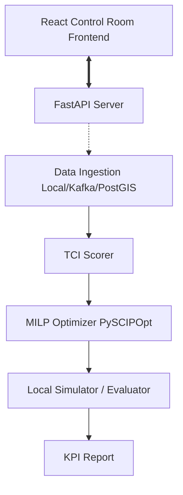

# SparkRail AI Block Planning System

An AI-Powered Automatic Block Planning System designed to maximize asset availability for train operations on Indian Railways (Problem Statement ID: 26027).

The system utilizes a hybrid approach, combining modern Machine Learning (for job criticality scoring) with rigorous Operations Research (MILP optimization) to build shadow block schedules.



---

## Key Capabilities

- **Task Criticality Index (TCI)**: Multi-attribute scoring prioritizing tasks based on Safety (40%), Delay Impact (30%), Degradation Velocity (20%), and Overdue Days (10%).
- **Shadow Block Optimizer (MILP)**: PySCIPOpt-based scheduler that optimally synchronizes compatible department jobs (Engineering, OHE, S&T) into consolidated possession windows, eliminating premium train disruptions.
- **Rolling Block Programme (RBP)**: Week 1 operational possessions are frozen; subsequent weeks are continuously optimized.
- **Deterministic Simulation Fallback**: Works out-of-the-box in standalone environments with realistic 8-block, 20-job, 10-train corridor datasets.
- **Control Room Frontend**: Complete 7-page control-room user interface adhering to Indian Railways operational standards.

---

## Frontend Control Room Interface

The frontend is located in [`frontend/`](file:///c:/Users/Chand/Documents/New%20folder/sparkrail/sparkrail/frontend) and provides a production-grade railway operations control room interface.

### Tech Stack
- React 19, TypeScript 5.8+, Vite 8
- Tailwind CSS v4 with OKLCH Color Tokens & Tabular Numerals
- Lucide Icons & Recharts
- Vitest + React Testing Library (23 unit & integration tests)

### 7 Primary Operational Views
1. **Operations Overview (`/overview`)**: Dominant operations summary, 8-metric KPI rail, today's corridor occupancy ribbon, ranked high-TCI queue, network status panel, solver trigger modal, and conflict review modal.
2. **Block Planner (`/planner`)**: 3-pane scheduling workspace with filters, horizontal 24-hour Gantt timeline (featuring frozen Week 1 treatment, immovable fixed blocks, and multi-department shadow blocks), and deep task inspector.
3. **Maintenance Jobs (`/jobs`)**: High-density tabular register with multi-column sorting, search, column visibility toggle, CSV export, and detail slide-over drawer.
4. **Live Operations (`/live`)**: Real-time schematic track diagram (0-80 km chainage), dynamic train positioning, simulation replay controls (Play, Pause, Reset, 1x-5x speed, scrubber), and crew telemetry.
5. **Asset Health (`/assets`)**: Ultrasonic flaw detection (USFD) records, track geometry indices, linear asset risk heatmap, and clear distinction between observed TMS sensor data and AI predicted failure risks.
6. **Reports (`/reports`)**: Side-by-side comparative analysis of AI-Optimized schedule against manual baseline operations across 9 dimensions (BUE, SBR, PII delay savings, closure hours), with CSV and JSON exports.
7. **Settings (`/settings`)**: API Base URL configuration, demo mode toggle, active division selector, TCI weight simulator, and experimental GNN/DRL research flags.

### Quick Start (Frontend)

```bash
cd frontend
npm install
npm run dev
```

Visit `http://localhost:5173` in your browser. By default, the frontend runs in **Demo Mode** with full deterministic simulation data.

To run automated tests and linting:
```bash
npm test -- --run
npm run lint
npm run build
```

---

## Backend Setup & CLI Usage

### Python Requirements
```bash
python -m pip install -r requirements.txt
cp .env.example .env
```

### CLI Commands
```bash
# Run end-to-end corridor optimization demo:
python -m src.cli demo

# Or run individual stages:
python -m src.cli generate-data
python -m src.cli score
python -m src.cli optimize
python -m src.cli evaluate
```

### FastAPI Server
```bash
uvicorn src.api.main:app --host 0.0.0.0 --port 8000 --reload
```

Endpoints exposed:
- `GET /health`: Server health and version
- `POST /data/generate`: Generate synthetic corridor dataset
- `POST /score`: Compute Task Criticality Index for all tasks
- `POST /optimize`: Run PySCIPOpt branch-and-cut solver
- `POST /evaluate`: Calculate KPI improvements against manual baseline
- `GET /schedule/{schedule_id}`: Retrieve latest optimized corridor schedule

### Backend Pytest Suite
```bash
pytest -q
```
