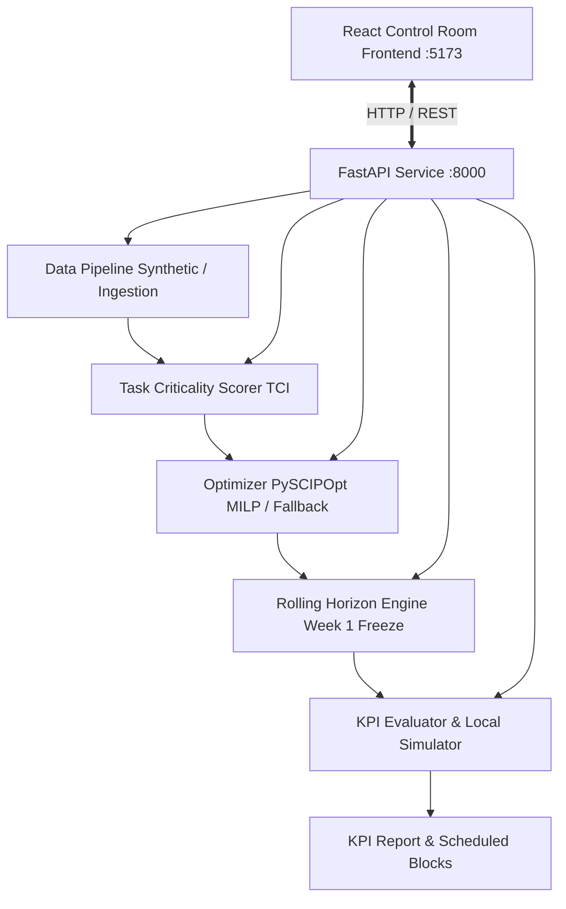

# SparkRail AI Block Planning System

An AI-Powered Automatic Block Planning System designed to maximize asset availability and eliminate train disruptions for railway operations (Indian Railways Problem Statement ID: 26027).

SparkRail combines modern Machine Learning (Task Criticality Index scoring) with rigorous Operations Research (Mixed-Integer Linear Programming) to optimize maintenance possessions, enforce safety power isolations, and synchronize multi-department shadow blocks.



---

## Architecture & System Design

1. **Data Pipeline (`src/data_pipeline/`)**:
   - Discrete track block section topology with linear chainage coordinates (km 0 to 80).
   - Multi-category train scheduling (premium passenger trains with strict delay bounds, express, freight).
   - Departmental maintenance jobs (`Engineering`, `OHE`, `S&T`) with resource demands, durations, and due dates.
   - Fixed, external immovable maintenance blocks.
2. **AI Criticality Scoring (`src/ai_ml/`)**:
   - Rule-based Task Criticality Index (TCI) engine with non-linear overdue penalty curves.
   - Strict input normalization [0, 100], sum-to-1.0 weight validation, and complete mathematical explanations.
   - Protection against untrained ML inferences.
3. **MILP Shadow Block Optimizer (`src/optimization/milp_solver.py`)**:
   - Exact branch-and-cut optimization powered by `PySCIPOpt` (SCIP solver engine).
   - Decision variables for job selection, start time, block possession closure, and shadow consolidation.
   - Safety constraints: OHE 25kV traction power isolation precludes concurrent S&T signaling testing on the same block.
   - Compatible consolidation: Engineering track machines (BCM/tie-tamping) can share possessions with OHE or S&T.
   - Premium train delay bounds: Hard upper bound on premium passenger delays ($\le 1.0$ hr).
   - Bounded Big-M modeling with startup possession penalties to avoid fragmented track closures.
   - Deterministic `NON_OPTIMAL_FALLBACK` heuristic when SCIP is unavailable.
4. **Rolling Horizon Engine (`src/optimization/rolling_horizon.py`)**:
   - **Week 1 Freeze**: Fixed hard lock on operational possessions in the immediate 24h/1-week window.
   - **Re-Optimization**: Dynamic rescheduling of flexible future weeks (Weeks 2-4).
   - **Weekly Rollover**: Advances timeline, archives executed jobs into historical execution log, rolls remaining jobs forward.
   - **Daily Disruption Replanning**: Injects emergency possessions without displacing frozen jobs.
   - **Audit Trail**: Structured change log recording every job shift, timestamp, delta, and rationale.
   - **Freight ETA Mode**: Scenario-based transit time predictions under varying possession intensities.
5. **FastAPI Backend (`src/api/main.py`)**:
   - Typed Pydantic request/response validation.
   - `X-Request-ID` tracing middleware and structured logging.
   - Sanitized error envelopes without leaking stack traces or internal server paths.
   - Configurable data directories and environment-based CORS.
6. **React Operations Control Room (`frontend/`)**:
   - 7 primary pages: Overview, Block Planner, Jobs Register, Live Operations, Asset Health, Reports, Settings.
   - Dual-mode operation: Live API connection or deterministic simulation demo mode.

---

## Distinction Between MVP, Optional Integrations & Experimental Prototypes

| Component | Status | Description |
|:---|:---|:---|
| **Core TCI Scorer** | **Production MVP** | Deterministic multi-attribute formula normalized to [0, 100] with full explanations. |
| **PySCIPOpt MILP** | **Production MVP** | Exact mathematical solver with OHE safety isolation, shadow rewards, and premium train limits. |
| **Fallback Scheduler** | **Production MVP** | Deterministic heuristic explicitly labeled `NON_OPTIMAL_FALLBACK` (never claims optimality). |
| **Rolling Horizon Engine**| **Production MVP** | Week 1 freeze, disruption replanning, rollover, and structured audit trail. |
| **FastAPI REST Service** | **Production MVP** | Typed Pydantic endpoints (`/health`, `/score`, `/optimize`, `/evaluate`, etc.). |
| **React 19 Frontend** | **Production MVP** | Complete 7-page control-room UI with WCAG AA compliance and interactive Gantt planner. |
| **Kafka / PostGIS** | **Optional Integration** | Ingestion placeholders for real-time COA/TMS streams in Indian Railways enterprise networks. |
| **XGBoost Degradation** | **Experimental Research** | Gradient boosted tree model requiring offline GMT training datasets; guarded against untrained inference. |
| **GNN State Encoder** | **Experimental Research** | PyTorch Geometric heterogeneous graph neural network prototype for topological embedding. |
| **DRL Tactical Dispatcher**| **Experimental Research**| Reinforcement learning agent (PPO) designed for sub-second conflict avoidance in SUMO. |

---

## Local Setup & Quick Start

### Prerequisites
- Python 3.11+
- Node.js 20+ & npm 10+
- (Optional) SCIP Optimization Suite for PySCIPOpt (Windows binary or Ubuntu package)

### 1. Backend Installation & Verification

```bash
# Install dependencies
python -m pip install -r requirements.txt

# Run syntax compilation check
python -m compileall src

# Run pytest test suite (32 unit & API tests)
pytest -q

# Run end-to-end CLI demo pipeline
python -m src.cli demo
```

### 2. Start FastAPI Server

```bash
uvicorn src.api.main:app --host 127.0.0.1 --port 8000
```

Verify backend health:
```bash
curl http://127.0.0.1:8000/health
```

### 3. Frontend Installation & Startup

```bash
cd frontend

# Install clean dependencies
npm ci

# Run linting and unit tests (23 tests)
npm run lint
npm test -- --run

# Build production bundle
npm run build

# Start Vite preview or development server
npm run dev
# or: npm run preview -- --port 5173
```

Visit `http://localhost:5173` to access the Control Room interface.

---

## Environment Variables

### Backend Configuration (`config/settings.yaml` or Environment)
- `SPARKRAIL_DATA_DIR`: Directory for synthetic scenarios and output files (default: `data`).
- `SPARKRAIL_CONFIG_PATH`: Path to YAML configuration (default: `config/settings.yaml`).
- `CORS_ORIGINS`: Comma-separated allowed HTTP origins (default: `http://localhost:5173,http://127.0.0.1:5173,http://localhost:3000`).
- `LOG_LEVEL`: Logging verbosity (`INFO`, `DEBUG`, `WARNING`).
- `GIT_COMMIT_SHA`: Current commit hash returned by `/health`.

### Frontend Configuration (`frontend/.env.example`)
- `VITE_API_BASE_URL`: Base URL for the FastAPI backend (e.g. `http://localhost:8000`).
- `VITE_DEMO_MODE`: Set to `false` for live backend operation; set to `true` to use standalone mock data.

---

## Task Criticality Index (TCI) Mathematical Formulation

The Task Criticality Index balances multiple competing railway operational factors:

$$\text{TCI} = w_{\text{safety}} \cdot S_{\text{safety}} + w_{\text{delay}} \cdot S_{\text{delay}} + w_{\text{degrad}} \cdot S_{\text{degrad}} + w_{\text{overdue}} \cdot S_{\text{overdue}}$$

Where:
- $S_{\text{safety}} \in [0, 100]$: Safety risk based on asset defect severity.
- $S_{\text{delay}} \in [0, 100]$: Potential corridor traffic capacity impact.
- $S_{\text{degrad}} \in [0, 100]$: Ultrasonic flaw / wear velocity.
- $S_{\text{overdue}} \in [0, 100]$: Non-linear penalty curve computed as:
  $$S_{\text{overdue}} = \min\left(1.0, \frac{\ln(1 + \text{days})}{\ln(1 + 30)}\right) \times 100$$
- Configurable weights strictly validated to sum to 1.0:
  $$w_{\text{safety}} = 0.40, \quad w_{\text{delay}} = 0.30, \quad w_{\text{degrad}} = 0.20, \quad w_{\text{overdue}} = 0.10$$

---

## Optimizer Behavior & Fallback Limitations

### PySCIPOpt MILP (Primary Solver)
- Formulates a discrete-time Mixed-Integer Linear Program.
- Objective: Minimize track possession hours, train delay cascades, and possession startups while maximizing completed TCI points and shadow block consolidation bonuses.
- Produces certifiable optimal or provably bounded solutions.

### Fallback Heuristic (`NON_OPTIMAL_FALLBACK`)
- Automatically engages if PySCIPOpt is not installed in the host Python environment.
- Deterministic, greedy priority placement based on descending TCI scores.
- **Limitations**:
  - Always labeled `NON_OPTIMAL_FALLBACK` with status `heuristic_feasible`.
  - May yield lower Shadow Block Ratios (SBR) and higher cumulative closure hours than MILP.
  - Does not explore non-greedy branch-and-cut combinations.

---

## REST API Endpoints

| Method | Route | Description |
|:---|:---|:---|
| `GET` | `/health` | System status, version, solver engine, data mode, and commit SHA |
| `POST` | `/data/generate` | Generates deterministic synthetic railway division dataset |
| `POST` | `/score` | Calculates normalized TCI scores with component explanations |
| `POST` | `/optimize` | Runs MILP or fallback optimizer, returning complete schedule |
| `POST` | `/evaluate` | Evaluates BUE, SBR, PII delay savings against manual baseline |
| `GET` | `/schedule/{id}` | Retrieves optimized schedule by ID (e.g. `/schedule/latest`) |
| `GET` | `/scenario` | Retrieves active block, train, job, and resource topology |
| `GET` | `/assets/health` | Returns track and electrical asset health telemetry |
| `GET` | `/events` | Returns control room operations audit and event stream |

---

## Automated Testing Suite

### Backend Pytest Suite
```bash
pytest -q
```
Covers:
- Model validation (track block chainage ordering, train schedules, fixed job constraints).
- TCI weight validation, normalization bounds [0, 100], overdue curves, and determinism.
- Untrained XGBoost inference protection.
- MILP solver optimality, department incompatibility (OHE vs S&T), and shadow consolidation.
- Premium train delay bounds ($\le 1.0$ hr).
- Fallback scheduler `NON_OPTIMAL_FALLBACK` labeling and exact unscheduled reasons.
- Rolling horizon Week 1 freeze, disruption replanning, rollover, and freight ETAs.
- Full API endpoint contracts, CORS headers, sanitized validation error envelopes, and request ID propagation.

### Frontend Vitest Suite
```bash
cd frontend && npm test -- --run
```
Covers:
- API client live vs demo mode switching.
- KPI calculations and comparison metric deltas.
- TCI badges and accessibility screen-reader landmarks.
- Block Planner Gantt timeline, Frozen Week 1 visual markers, and task inspector.
- Maintenance Jobs tabular register, multi-column search, and department filters.

---

## Known Limitations
1. **Remote Kafka/PostGIS Ingestion**: Configured as an optional enterprise integration; in local and standalone environments, the deterministic synthetic data pipeline is utilized.
2. **PySCIPOpt Platform Availability**: PySCIPOpt requires compatible SCIP shared libraries on Linux/macOS/Windows. If binary wheels are absent, SparkRail smoothly falls back to `NON_OPTIMAL_FALLBACK` without crashing.
3. **DRL / GNN Modules**: Provided as research prototypes in `src/ai_ml/` and labeled as experimental in the settings UI.
