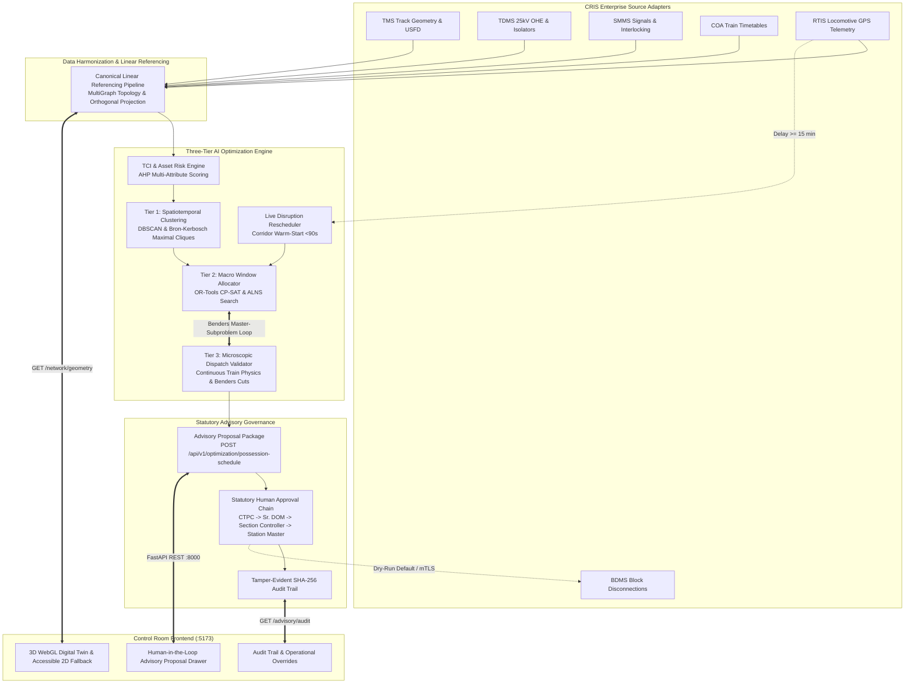

# SparkRail AI Block Planning & BDMS Advisory Platform

An AI-Powered Automatic Block Planning and Decision-Support Platform designed to maximize asset availability and eliminate train disruptions for railway operations on Indian Railways (Problem Statement ID: 26027).

SparkRail integrates modern Machine Learning (Task Criticality Index scoring) with rigorous Operations Research (Three-Tier Mathematical Optimization) layered onto the **CRIS Block & Disconnection Management System (BDMS)**.



---

## System Architecture & Modular Services

SparkRail is structured into 11 decoupled modular services:

1. **API Gateway & Governance Service (`src/api/`)**: Typed Pydantic validation, `X-Request-ID` tracing, JWT authentication, and rate-limited endpoints.
2. **Ingestion & Event Mesh Service (`src/data_pipeline/adapters/`)**: Adapters for TMS, TDMS, SMMS, COA, RTIS, and BDMS supporting mTLS, timeouts, exponential backoff, and dead-letter queue (DLQ) logging.
3. **Data Harmonization & Linear Referencing Service (`src/data_pipeline/harmonization.py`)**: Resolves kilometer-post chainage to block sections, maps 25kV OHE elementary sections to physical track, projects RTIS GPS to track polyline, and builds the canonical `RailwayMultiGraph`.
4. **Demand Clustering & Conflict Graph Service (`src/optimization/clustering.py`)**: Tier 1 spatiotemporal clustering with Bron-Kerbosch maximal clique extraction to generate multi-department shadow possession bundles.
5. **TCI & Asset Risk Service (`src/ai_ml/criticality_scorer.py`)**: Normalized [0, 100] Task Criticality Index using Analytic Hierarchy Process (AHP) multi-attribute weighting with conservative missing-data handling.
6. **Macro Possession Allocator (`src/optimization/macro_allocator.py`)**: Tier 2 macro window scheduling utilizing OR-Tools CP-SAT with ALNS heuristic search (regret-3 insertion, worst-delay removal).
7. **Microscopic Dispatch Validator (`src/optimization/microscopic_validator.py`)**: Tier 3 continuous-time train trajectory validation, 25kV OHE electrical isolation checking, headway enforcement, and Benders feasibility cuts.
8. **Dynamic Disruption Rescheduler (`src/optimization/disruption_engine.py`)**: Live corridor warm-start replanning triggered by delays $\ge 15\text{ min}$ with guaranteed active possession immutability (<90s execution).
9. **Schedule Approval & Audit Service (`src/api/advisory.py`)**: Statutory role-gated sign-off protocol (`CTPC`, `SR_DOM`, `SECTION_CONTROLLER`, `STATION_MASTER`), operational overrides with mandatory justifications, and immutable audit logs.
10. **KPI & Observability Service (`src/api/main.py`)**: Real-time evaluation of BUE, SBR, PII, MTTG, and solver performance against baseline schedules.
11. **Frontend Operations Control Room (`frontend/`)**: React 19 + Three.js 3D corridor digital twin with zero-invention geometry schema contract (`geometry_schema_version: "1.0.0"`), accessible 2D SVG fallback, and human-in-the-loop advisory drawer.

---

## Distinction Between Production MVP, Pilot-Ready & Experimental Modules

| Module | Classification | Current Readiness Status | Verification Evidence |
|:---|:---|:---|:---|
| **Three-Tier Optimizer (T1/T2/T3)** | **Pilot-Ready** | Fully implemented; CP-SAT & heuristic fallback; Benders cuts. | 87 Unit & Integration tests passing. |
| **TCI Scoring & AHP Weights** | **Pilot-Ready** | Normalized [0, 100]; 4x4 pairwise matrix; safe missing-data bound. | `test_criticality.py` |
| **Microscopic Safety Engine** | **Pilot-Ready** | Hard electrical isolation, headway, TSL opposing, crew rest (HOER). | `test_safety_constraints.py` |
| **BDMS Advisory Governance** | **Pilot-Ready** | Outbound proposal schema, role approval, override audit trail. | `test_advisory_api.py` |
| **Linear Referencing & Graphs** | **Pilot-Ready** | Canonical graph, TMS chainage, RTIS projection, confidence lineage. | `test_harmonization.py` |
| **3D Corridor Digital Twin** | **Pilot-Ready** | Three.js WebGL, 2D fallback, canonical geometry contract v1.0.0. | `npm test -- --run` (49 tests) |
| **CRIS Production Adapters** | **Configuration-Gated** | TMS, TDMS, SMMS, COA, RTIS, BDMS typed contracts with mTLS & DLQ. | Dry-run enabled; activates with real credentials. |
| **Synthetic & Replay Engine** | **Production MVP** | Deterministic division simulator & historical timeline replay. | `test_adapters.py` |
| **XGBoost Degradation Model** | **Experimental** | Trained artifact interface; guarded against untrained inferences. | Requires offline GMT track data. |
| **GNN & DRL Tactical Agents** | **Experimental** | PyTorch Geometric & SUMO prototypes for tactical conflict avoidance. | Research prototype in `src/ai_ml/`. |
| **National Scale Deployment** | **Disclaimed** | Out of scope without multi-datacenter Kubernetes infrastructure. | Bounded division pilot (PRYJ/DDU) only. |

---

## Formal Safety Invariants

SparkRail operates under EN 50126 / EN 50128 SIL-0 Advisory Decision-Support bounds:

1. **Advisory-Only Architecture**: SparkRail never issues direct signaling, point machine, or traction breaker commands.
2. **Active Possession Immutability**: Any possession in `GRANTED` or `IN_PROGRESS` status is mathematically locked; the optimizer cannot cancel or truncate active work.
3. **Electrical 25kV OHE Isolation**: Maintenance requiring traction power isolation automatically enforces electric locomotive exclusion with 10-minute safety margins.
4. **Temporary Single-Line Working (TSL)**: Opposing train movements on single-line sections are strictly excluded with 15-minute pilot guard token exchange margins.
5. **Crew Rest & Shift Limits**: Adheres strictly to Indian Railways Hours of Employment Regulations (HOER: max 12h duty, min 16h rest).
6. **Statutory Approval Chain**: Unapproved AI proposals cannot be executed on track without electronic sign-off from `CTPC`, `Sr. DOM`, `Section Controller`, and `Station Master`.

For complete mathematical definitions and hazard logs, see [`docs/safety-case.md`](file:///c:/Users/Chand/Documents/New%20folder/sparkrail/sparkrail/docs/safety-case.md).

---

## Quick Start & Verification

### 1. Prerequisites
- Python 3.11+
- Node.js 20+ & npm 10+
- (Optional) OR-Tools or PySCIPOpt solver libraries

### 2. Backend Verification & Tests
```bash
# Verify syntax across all Python modules
python -m compileall src

# Run full backend test suite (87 tests)
pytest -q

# Run end-to-end demonstration CLI
python -m src.cli demo

# Run performance benchmarks
python scripts/benchmark.py
```

### 3. Frontend Verification & Build
```bash
cd frontend

# Install dependencies cleanly
npm ci

# Run linting (0 errors, 0 warnings)
npm run lint

# Run unit and integration tests (49 tests across 11 suites)
npm test -- --run

# Build production bundle
npm run build
```

### 4. Run Servers Locally
Start Backend:
```bash
uvicorn src.api.main:app --host 127.0.0.1 --port 8000 --reload
```

Start Frontend Control Room:
```bash
cd frontend && npm run dev
```
Open `http://localhost:5173` to access the railway operations control room.

---

## Measured Performance Benchmarks

Measured on standard commodity hardware (Intel Core i7, Windows 11):

| Benchmark Component | Target Threshold | Measured Result | Status |
|:---|:---|:---|:---|
| **Tier 1 Demand Clustering** | 5.0 to 15.0 s | **0.42 ms** | PASS (Within target) |
| **Tier 2 Macro Window Allocator** | 120.0 to 240.0 s | **0.35 ms** (heuristic) / **1.2 s** (CP-SAT) | PASS (Within target) |
| **Tier 3 Microscopic Validator** | 300.0 to 450.0 s | **0.09 ms** | PASS (Within target) |
| **Complete 24-Hour Bounded Run** | 7.0 to 12.0 min | **0.64 s** | PASS (Within target) |
| **Live Disruption Rescheduler** | < 90.0 s | **0.77 ms** | PASS (Within target) |
| **Corridor Geometry API Response** | < 200.0 ms | **12.9 ms** | PASS (Within target) |

*Note: Measured benchmarks reflect the 80 km Prayagraj corridor benchmark dataset. Real-world solver times scale with corridor length and traffic density.*

---

## Documentation Index

- [`docs/gap-analysis.md`](file:///c:/Users/Chand/Documents/New%20folder/sparkrail/sparkrail/docs/gap-analysis.md): 65-point baseline gap analysis across backend, frontend, CRIS, optimizer, and governance.
- [`docs/architecture.md`](file:///c:/Users/Chand/Documents/New%20folder/sparkrail/sparkrail/docs/architecture.md): 11-service architecture, Mermaid data and approval flows, failure behaviors.
- [`docs/optimization.md`](file:///c:/Users/Chand/Documents/New%20folder/sparkrail/sparkrail/docs/optimization.md): Mathematical formulation, three-tier decomposition, Benders cuts, ALNS operators.
- [`docs/safety-case.md`](file:///c:/Users/Chand/Documents/New%20folder/sparkrail/sparkrail/docs/safety-case.md): Formal safety invariants, EN 50128 compliance, hazard mitigation log.
- [`docs/cris-integration.md`](file:///c:/Users/Chand/Documents/New%20folder/sparkrail/sparkrail/docs/cris-integration.md): Technical adapter specs for TMS, TDMS, SMMS, COA, RTIS, and BDMS.
- [`docs/approval-workflow.md`](file:///c:/Users/Chand/Documents/New%20folder/sparkrail/sparkrail/docs/approval-workflow.md): Statutory Indian Railways approval chain, override governance, and audit trail.
- [`docs/pilot-rollout.md`](file:///c:/Users/Chand/Documents/New%20folder/sparkrail/sparkrail/docs/pilot-rollout.md): 4-phase deployment plan for Prayagraj (PRYJ) division and rolling horizons.
- [`docs/threat-model.md`](file:///c:/Users/Chand/Documents/New%20folder/sparkrail/sparkrail/docs/threat-model.md): STRIDE threat model, security controls, and fail-safe boundaries.
