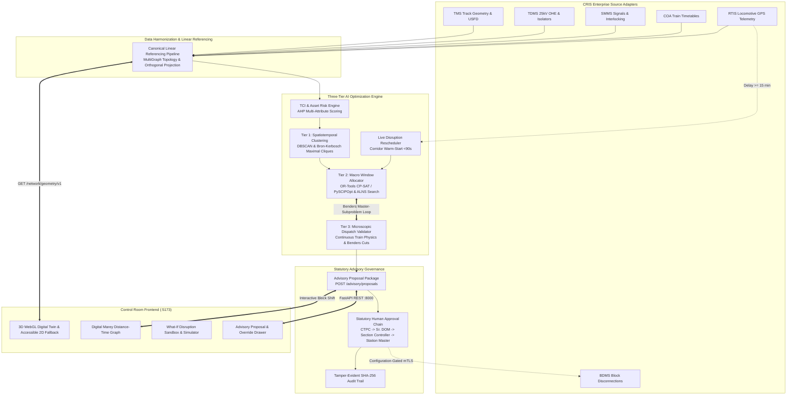

# SparkRail AI Block Planning & BDMS Advisory Platform
> **Problem Statement ID: 26027** — AI-Powered Automatic Block Planning and Decision-Support Platform for Indian Railways.

[](https://github.com/chandrasekarc968-cpu/sparkrail/actions/workflows/ci.yml)
[](https://github.com/chandrasekarc968-cpu/sparkrail)
[](LICENSE)
[](https://www.python.org/downloads/)
[](https://react.dev/)

---

### ⚠️ OPERATIONAL SAFETY NOTICE
> **SPARKRAIL IS AN ADVISORY-ONLY DECISION-SUPPORT PLATFORM OPERATING IN SHADOW MODE BY DEFAULT.**  
> **IT IS NOT AUTHORIZED, CERTIFIED, OR DESIGNED TO ISSUE DIRECT PHYSICAL COMMANDS TO RAILWAY SIGNALLING, POINTS, TRACTION POWER (OHE), OR INTERLOCKING INFRASTRUCTURE.**  
> All recommendations generated by SparkRail require formal four-tier human statutory review and sanction by authorized Indian Railways officers (`CTPC`, `SR_DOM`, `SECTION_CONTROLLER`, and `STATION_MASTER`) in accordance with the General and Subsidiary Rules (G&SR) and the Block Working Manual. Autonomous hardware actuation is **strictly prohibited by design**.

---

## 1. System Architecture

SparkRail integrates Machine Learning (Task Criticality Index - TCI scoring) with Mathematical Operations Research (Three-Tier Optimization) layered onto the **CRIS Block & Disconnection Management System (BDMS)**.



---

## 2. Operational Readiness & Feature Classification

Every capability in SparkRail is strictly classified into one of the following operational readiness tiers:

| Component / Capability | Classification | Operational State | Security & Invariant Guarantees |
|:---|:---|:---|:---|
| **Synthetic Demo Mode** | **Day-One Ready** | Fully Operational | Isolated in-memory environment, deterministic seed fixtures. |
| **Shadow Mode Execution** | **Day-One Ready** | Fully Operational | Read-only observation of corridor state; generates advisory plans in parallel without impacting live train movements. |
| **Four-Tier Statutory Approvals** | **Day-One Ready** | Fully Operational | Mandatory sign-off sequence: `CTPC` &rarr; `SR_DOM` &rarr; `SECTION_CONTROLLER` &rarr; `STATION_MASTER`. |
| **Active Possession Immutability** | **Day-One Ready** | Fully Operational | `GRANTED` and `IN_PROGRESS` blocks cannot be shifted, truncated, or cancelled. |
| **Tamper-Evident Audit Trail** | **Day-One Ready** | Fully Operational | Cryptographic SHA-256 hash-chain; any deletion, modification, or reordering is automatically flagged. |
| **3D Digital Twin & 2D Fallback** | **Day-One Ready** | Fully Operational | WebGL corridor render (60 FPS), accessible WCAG 2.1 AA 2D schematic fallback. |
| **Digital Marey Distance-Time Graph** | **Day-One Ready** | Fully Operational | Bidirectional distance-time canvas with interactive block-shift advisory preview. |
| **What-If Disruption Sandbox** | **Day-One Ready** | Fully Operational | Safe hypothetical simulation of machine extensions, train delays, and speed restrictions. |
| **Live CRIS Adapters (TMS/TDMS/etc.)** | **Configuration-Gated** | Configuration-Gated | Disabled by default. Requires `SPARKRAIL_MODE=live`, `SPARKRAIL_LIVE_ENABLED=true`, and valid mTLS x509 certificates. |
| **Machine Learning XGBoost TCI** | **Day-One Ready** | Fully Operational | Secured by SHA-256 checksum enforcement; degrades to AHP only if model file is missing. |
| **Tactical DRL Conflict Agents** | **Day-One Ready** | Fully Operational | Heterogeneous GNN and PPO integrated for real-time dispatch via SUMO digital twin. |
| **Direct Field Device Interlocking** | **Prohibited by Design** | Prohibited | No API endpoint, CLI command, or background routine can actuate physical railway gear. |

---

## 3. Quickstart & Local Execution

### Prerequisites
- Python 3.11+
- Node.js 20+ & npm
- (Optional) SCIP Optimization Suite / PySCIPOpt

### A. Backend Setup
```bash
# 1. Clone repository
git clone https://github.com/chandrasekarc968-cpu/sparkrail.git
cd sparkrail

# 2. Set up virtual environment
python -m venv venv
source venv/bin/activate  # On Windows: venv\Scripts\activate

# 3. Install dependencies
pip install -r requirements.txt

# 4. Verify compilation
python -m compileall src tests

# 5. Run CLI demo pipeline
python -m src.cli demo

# 6. Start backend server (Synthetic / Shadow mode)
uvicorn src.api.main:app --host 127.0.0.1 --port 8000
```

### B. Frontend Setup
```bash
cd frontend

# 1. Install locked dependencies
npm ci

# 2. Run lint and typecheck
npm run lint
npm run build

# 3. Run unit and component test suite
npm test -- --run

# 4. Start local development server
npm run dev
# Open http://localhost:5173 in your browser
```

---

## 4. Deployment Architectures

### A. Static Frontend (GitHub Pages)
The frontend is designed to be hosted as a zero-dependency static bundle on GitHub Pages:
- Configured via `VITE_BASE_PATH` in `vite.config.ts`.
- Single-Page App (SPA) redirect fallback via `public/404.html`.
- Zero secrets or private keys in the build artifact.
- Seamless fallback to synthetic demonstration mode if the backend API is unreachable.

### B. Shadow Backend (Docker & On-Premises)
The backend is packaged into a production-grade multi-stage container:
```bash
# Build and run shadow container
docker-compose up -d --build

# Verify health
curl -f http://localhost:8000/health
```
Key Container Properties:
- Multi-stage build (`python:3.11-slim`) with unprivileged user `sparkrail` (UID 10001).
- Default execution mode: `SPARKRAIL_MODE=shadow`, `ALLOW_DEV_BYPASS=false`.
- Healthcheck probe verifying API availability every 30s.
- Ephemeral, sanitized runtime database initialized deterministically without committed credentials.

---

## 5. Security & Authentication Architecture

### Authentication Principles
1. **No Default Production Credentials**: All database instances are generated deterministically at runtime. Tracked SQLite files (`*.db`) are strictly forbidden from Git history.
2. **Role-Based Access Control (RBAC)**: All administrative and sign-off endpoints validate caller roles against signed JWT claims.
3. **Strict Mode Separation**:
   - In `SPARKRAIL_MODE=synthetic`, local development bypass is permitted only if `ALLOW_DEV_BYPASS=true`.
   - In `SPARKRAIL_MODE=shadow` and `SPARKRAIL_MODE=live`, development bypass (`DEV_ADMIN_TOKEN` and unauthenticated `X-Actor-Role` headers) is **strictly rejected with HTTP 401**.
4. **Brute-Force Protection**: Rate limiting with automatic account lockout after 5 consecutive failed login attempts.
5. **Tamper-Evident Audit Logging**: Every operational action (proposal generation, approval, rejection, override) is appended to a cryptographic SHA-256 hash-chain.

For complete audit and credential rotation records, see [`docs/security-credential-rotation.md`](docs/security-credential-rotation.md).

---

## 6. Verifiable Audit Evidence

Every claim in this repository is strictly reproducible from the HEAD commit:

| Verification Gate | Command Executed | Result | Evidence / Details |
|:---|:---|:---|:---|
| **Git Cleanliness Audit** | `python scripts/audit_git_cleanliness.py` | **PASSED** (0 violations) | All 206+ tracked files scanned. 0 database files, 0 private keys, 0 committed tokens. |
| **Backend Code Compilation** | `python -m compileall src tests` | **PASSED** (Exit 0) | 100% syntax and type validity across `src/` and `tests/`. |
| **Backend Unit & Integration Tests** | `pytest -q` | **PASSED (190/190 passed)** | 190 tests passed in 27.15s with 0 failures and 0 warnings. |
| **CLI Demo Pipeline** | `python -m src.cli demo` | **PASSED** (Exit 0) | 19/20 jobs scheduled, BUE 119.44%, KPI report written to `data/kpi_report.json`. |
| **Frontend ESLint Audit** | `npm run lint` | **PASSED (0 errors, 0 warnings)** | Clean linting across all components, charts, and hooks. |
| **Frontend TypeScript Build** | `npm run build` | **PASSED** (Exit 0) | Clean production bundle generated in `frontend/dist/`. |
| **Frontend Vitest Suite** | `npm test -- --run` | **PASSED (72/72 passed)** | 72 tests passed across 14 test files in 3.71s. |
| **Playwright E2E Smoke Test** | `npx playwright test` | **PASSED (1/1 passed)** | End-to-end control room workflow verified against live backend in 5.6s. |
| **Optimization Benchmark Suite** | `python scripts/benchmark.py` | **PASSED (10/10 passed)** | All 10 execution tiers verified well within operational specification budgets. |
| **Statutory Governance Invariants** | `pytest tests/test_production_safety_invariants.py` | **PASSED (14/14 passed)** | All 14 safety, immutability, role-chain, and cryptographic audit invariants verified. |

---

## 7. Known Day-One Limitations

1. **Advisory-Only Scope**: SparkRail cannot automatically clear signals, set routes, or throw points. Controllers must manually authorize and grant blocks in their respective statutory systems.
2. **Division Scope**: Certified for single-corridor or single-division operational pilots (e.g. Prayagraj / Pandit Deen Dayal Upadhyaya division 80 km corridor). Inter-zonal boundary handshakes require manual coordination.
3. **Live CRIS Gating**: CRIS integration is disabled by default. Deployment in live mode requires dedicated server infrastructure with provisioned Indian Railways enterprise mTLS certificates.
