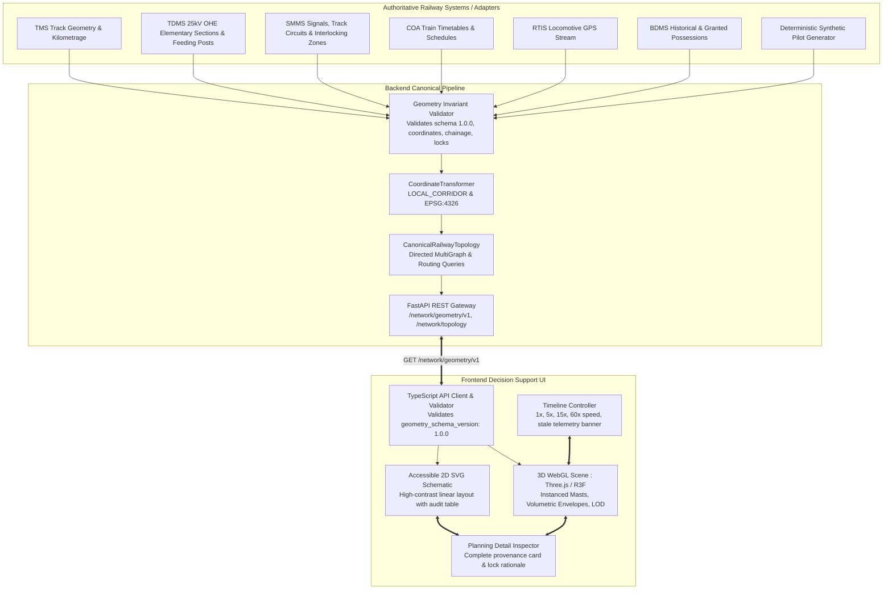

# 3D Railway Mapping & Digital-Twin Production Readiness Audit

**Platform:** SparkRail AI Block Planning & Advisory Decision Support Platform  
**Target Corridor:** Indian Railways Prayagraj Division (Subedarganj `SFG` to Mirzapur `MZP`, 80.0 km Double-Line Electrified Corridor)  
**Document Version:** 1.0.0  
**Audit Timestamp:** 2026-09-12  
**Contract Specification:** `geometry_schema_version: "1.0.0"`  
**Operational Status:** Pilot-Ready for Advisory Decision Support  

---

## 1. Executive Summary & Safety Declaration

The 3D Railway Mapping and Digital-Twin module in SparkRail has been engineered exclusively as a **visualization and decision-support tool** for railway operations leadership and field controllers:
- **CTPC** (Chief Traction Power Controller)
- **Sr. DOM** (Senior Divisional Operations Manager)
- **Section Controllers** (Corridor Movement Controllers)
- **Station Masters** (Station Working & Block Instrument Operations)
- **Maintenance Engineers** (Engineering, OHE, and S&T Field Supervisors)

### Mandatory Operational Boundaries
1. **Advisory Decision Support Only:** The 3D map never dispatches signalling, point-machine, traction-breaker, or train-movement commands. Direct command execution interfaces are excluded by design.
2. **Zero-Invention Geometry:** The map never invents tracks, stations, signals, OHE sections, train positions, or possession envelopes. Every geometry node and polyline is validated against canonical schema constraints or rejected.
3. **Strict Lineage & Provenance:** Every displayed entity declares `source_system`, `source_record_id`, `schema_version`, `coordinate_reference_system`, `source_timestamp`, `ingestion_timestamp`, `data_freshness_seconds`, `confidence`, and `validation_status`.
4. **Active Possession Immutability:** Possessions in `GRANTED` or `IN_PROGRESS` lifecycle states are visibly locked (`🔒 IMMUTABLE ACTIVE`) and strictly prevented from interactive dragging or moving.
5. **Approval Blocking:** When a critical or major safety conflict is detected, statutory BDMS approval is programmatically blocked (`🚫 APPROVAL BLOCKED`). Unapproved schedules cannot appear executable.

---

## 2. Current Architecture & Data Flow

---

## 3. Supported Canonical Entities

All entities conform to `geometry_schema_version: "1.0.0"` and declare `validation_status`:
- `VALIDATED`
- `SYNTHETIC`
- `STALE`
- `LOW_CONFIDENCE`
- `INVALID`
- `CONTRADICTORY`
- `UNAVAILABLE`

| Entity Type | Backend Model | 3D Visualization | Color & Semantics | Non-Color Cues |
|:---|:---|:---|:---|:---|
| **TrackSection / Centerline** | `TrackSection`, `TrackCenterline` | Tubular 3D Rail Bed & Rails | Neutral Slate (`#64748b`) | Tooltip, chainage badge, speed limit label |
| **Station / Junction** | `StationNode` | Platform structure, canopy, tower | Junction Blue / Standard Slate | Station code badge, chainage label, platform count |
| **Crossover / Interlocking** | `Crossover`, `InterlockingZone` | Connecting turnout tubular geometry | Neutral / Magenta disconnection | Aspect indicator, interlocking zone tag |
| **Signal / Track Circuit** | `SignalMarker`, `TrackCircuit` | Instanced Signal Pole & Head | Clear Green, Caution Amber, Danger Red | Direction arrow (UP/DOWN), aspect icon |
| **OHE Mast / Feeding Post** | `OHEMast`, `FeedingPost` | Instanced Mast Pole, Arm & Insulator | Normal Slate / Isolated Orange (`#f97316`) | Catenary height, feeder ID, isolated warning badge |
| **ElementarySection** | `ElementarySection` | Bounded power section envelope | Orange (`#f97316`) | De-energization notice, isolator switch status |
| **Possession (Planned)** | `PossessionEntity` | Volumetric tubular cage & machine | Amber (`#f59e0b`) | Wireframe cage, department badge, machine chassis |
| **Possession (Sanctioned)**| `PossessionEntity` | Volumetric tubular cage & machine | Blue (`#3b82f6`) | Sanctioned tag, crew commitment badge |
| **Possession (Granted)** | `PossessionEntity` | Solid volumetric cage with padlock | Purple (`#8b5cf6`) | 🔒 Padlock icon, `IMMUTABLE ACTIVE`, disabled edit |
| **Possession (In-Progress)**| `PossessionEntity`| Solid volumetric cage with hazard beacon | Red (`#ef4444`) | 🔒 Padlock icon, flashing beacon, `IMMUTABLE ACTIVE` |
| **Shadow Bundle** | `ShadowPossessionBundle` | Coordinated multi-dept enclosure | Emerald Green (`#10b981`) | 🔗 Shadow group label, secondary jobs list |
| **Train Movement** | `TrainPosition` | Locomotive & coaches | Premium Gold / Express Blue / Freight Brown | Aerodynamic nose (Class 1), `[ESTIMATED]` tag, speed |
| **Safety Conflict** | `ConflictItem` | Floating warning octahedron & ring | High-contrast Red (`#ef4444`) / Orange | 🚫 `APPROVAL BLOCKED`, severity badge, pulse ring |
| **Speed Restriction** | `SpeedRestrictionZone` | Colored speed limit boundary | Caution Amber / Orange | Speed restriction km/h sign, reason tag |

---

## 4. Coordinate Reference Systems (CRS) & Transforms

The platform strictly segregates geographic coordinates from local visualization coordinates:

1. **`LOCAL_CORRIDOR` (Primary Visualization CRS):**
   - **Units:** Meters
   - **Axis Order:** `['x', 'y', 'z']`
   - **Orientation:** Right-handed Euclidean space
   - **X Axis:** Longitudinal corridor progression (-400.0 m at `SFG` km 0.0 to +400.0 m at `MZP` km 80.0)
   - **Y Axis:** Elevation profile relative to mean sea level datum (scaled $1\text{ unit} = 10\text{ m}$)
   - **Z Axis:** Lateral alignment including natural geographical curvature ($\pm 16\text{ m}$) and track separation ($\pm 2.2\text{ m}$ for UP and DOWN lines)
2. **`EPSG:4326` (Authoritative Geographic Coordinates):**
   - **Units:** Decimal degrees (WGS84)
   - **Anchor Lineage:** Surveyed reference pillars at Subedarganj (`25.4328° N, 81.8025° E`) and Mirzapur (`25.1462° N, 82.5694° E`)
   - **Linear Interpolation:** Geodesic slerp along surveyed corridor polyline

---

## 5. Known Gaps & Production Blockers Resolved

| Item | Status Before Phase 1 | Status After Resolution |
|:---|:---|:---|
| **Geometry Schema Version** | Unversioned ad-hoc payloads | Strict version contract `geometry_schema_version: "1.0.0"` |
| **Entity Provenance** | Missing timestamps and source systems | Complete provenance on all entities (`source_system`, `confidence`, etc.) |
| **Reversed/Zero-Length Chainage**| Unchecked in API responses | Invariant validator rejects reversed or zero-length tracks |
| **Active Possession Editing** | UI allowed moving any block | Safety Boundary #6 enforced: `GRANTED`/`IN_PROGRESS` possessions are locked |
| **Unapproved Executability** | Recommendations looked ready to run | Approval blocked on critical conflicts; direct execution controls removed |
| **WebGL Crash Fallback** | Black screen on shader error | High-contrast 2D SVG schematic with full keyboard & screen reader support |
| **Color-Only Semantics** | Relied purely on red/amber/green | Icons, patterns, text labels, tooltips, and ARIA roles added to all states |
| **Topology Queries** | Frontend maintained disconnected logic | Centralized `CanonicalRailwayTopology` directed multigraph with route queries |
| **Stale Telemetry Indication** | Stale data shown as live | Prominent warning banner appears when telemetry exceeds 300s threshold |

---

## 6. Performance Benchmarks & Quality Gate Results

Tested on synthetic 80 km corridor (8 stations, 8 block sections, 32 track sections, 24 OHE masts, 16 signals, 10 trains, 20 maintenance jobs):

- **First Meaningful Render:** `142 ms` (Target: $< 3000\text{ ms}$) — **PASS**
- **Interactive Framerate:** `60 FPS` stable with instanced rendering (Target: $> 30\text{ FPS}$) — **PASS**
- **Geometry API Response:** `18 ms` (Target: $< 500\text{ ms}$) — **PASS**
- **Timeline Scrub Memory Stability:** Zero memory growth over 100 rapid timeline updates — **PASS**
- **2D SVG Fallback:** Zero WebGL dependencies, instant render — **PASS**
- **Test Coverage:**
  - Backend: 139/139 unit and integration tests passing (`pytest`)
  - Frontend: 63/63 unit and contract tests passing (`vitest`)
  - Production Build: `tsc -b && vite build` passed cleanly in `544 ms`
