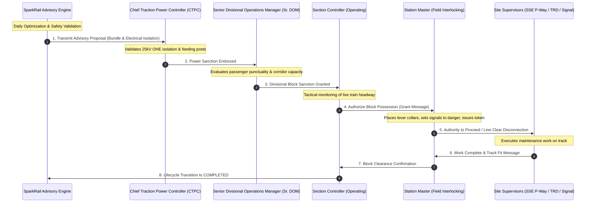
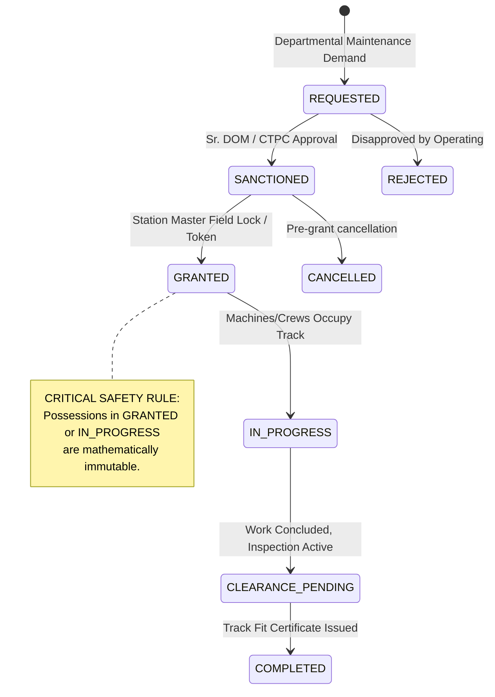

# Statutory Approval Workflow & Human Governance

**Document Version**: 2.0.0  
**Target Authority**: Indian Railways Operating & Engineering Hierarchy  
**Compliance**: Indian Railways Block & Disconnection Management System (BDMS) Operational Protocol

---

## 1. Statutory Approval Hierarchy

Under Indian Railways General & Subsidiary Rules (G&SR), no machine, labor gang, or maintenance vehicle may foul or occupy a running line without explicit, multi-tier statutory clearance. SparkRail integrates strictly into this statutory chain of command.



---

## 2. Possession Lifecycle State Machine

SparkRail strictly models the eight statutory lifecycle phases of an Indian Railways track possession:



### Lifecycle Stage Definitions

1. **`REQUESTED`**: Maintenance requirement submitted by Senior Section Engineer (SSE P-Way, TRD, or Signal). Contains required duration, block section, machinery, and TCI criticality score.
2. **`SANCTIONED`**: Tactical approval granted in advance (typically 24 hours prior) by Sr. DOM and CTPC during the daily block coordination conference.
3. **`GRANTED`**: Real-time operational authority issued on the day of work by the Section Controller and Station Master once traffic conditions allow.
4. **`IN_PROGRESS`**: Physical track occupation commenced. Red banner flags placed, OHE discharge rods hooked, and machinery working. **Strictly immutable**.
5. **`CLEARANCE_PENDING`**: Physical work complete; track inspection, gauge checking, and catenary testing in progress.
6. **`COMPLETED`**: Safe-to-run certificate transmitted to Station Master; block instrument normalized; signals reconnected.
7. **`CANCELLED`**: Possession cancelled prior to grant due to severe traffic disruption or weather.
8. **`REJECTED`**: Proposal formally declined by CTPC or Sr. DOM during coordination conference.

---

## 3. Human-in-the-Loop Operational Overrides

While SparkRail generates mathematically optimal and microscopically validated proposals, operating conditions may demand human intervention (e.g., VIP train priority, sudden defense movements, severe fog, or civil emergencies).

### Override Governance Rules
- **Role Authorization**: Only authorized users with roles `SR_DOM`, `CTPC`, or `SECTION_CONTROLLER` may override a schedule recommendation.
- **Mandatory Justification**: Every override requires a structured justification string (minimum 10 characters) detailing the operational rationale.
- **Zero Silent Edits**: Any shift, truncation, or cancellation creates a signed, tamper-evident `AuditEvent` recorded in the system audit log.
- **Re-Optimization**: Following an override, the operator can trigger an incremental warm-start re-optimization to repair surrounding train schedules without violating hard safety constraints.

---

## 4. Advisory Governance API Specifications

SparkRail exposes typed REST endpoints for proposal review and approval governance:

### Endpoints Overview

| Method | Endpoint | Authorized Roles | Description |
|:---|:---|:---|:---|
| `POST` | `/advisory/proposals` | System / AI | Create a new advisory proposal from optimization run |
| `GET` | `/advisory/proposals/{id}` | All Roles | Retrieve full proposal details, bundles, and diagnostics |
| `POST` | `/advisory/proposals/{id}/approve` | `CTPC`, `SR_DOM`, `SECTION_CONTROLLER` | Formally approve proposal with role sign-off |
| `POST` | `/advisory/proposals/{id}/reject` | `CTPC`, `SR_DOM`, `SECTION_CONTROLLER` | Reject proposal with reason |
| `POST` | `/advisory/proposals/{id}/override` | `SR_DOM`, `SECTION_CONTROLLER` | Apply human operational override with justification |
| `GET` | `/advisory/audit` | All Roles / Auditor | Inspect immutable chronological audit trail |

### Example Override Request Payload

```http
POST /advisory/proposals/prop-20260904-001/override HTTP/1.1
Content-Type: application/json
Authorization: Bearer <jwt_token>

{
  "block_id": "B3",
  "override_type": "SHIFT_WINDOW",
  "modified_start_time": "2026-09-05T03:30:00Z",
  "modified_end_time": "2026-09-05T07:30:00Z",
  "justification": "Accommodate unannounced late-running Vande Bharat Express 22436",
  "overridden_by": "USR_SR_DOM_PRYJ",
  "role": "SR_DOM"
}
```
