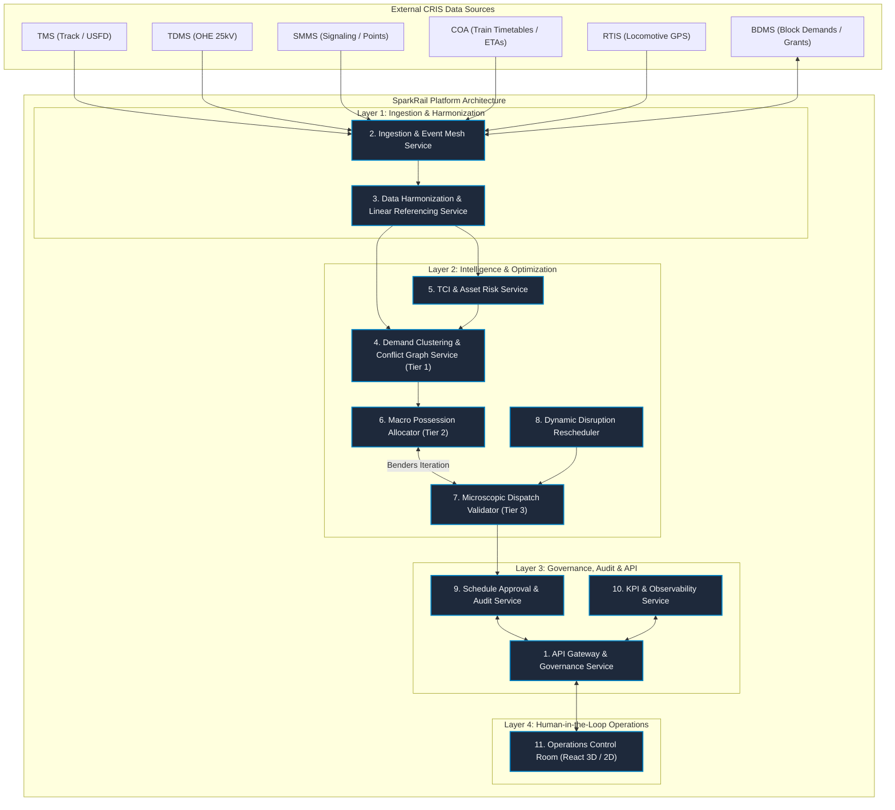
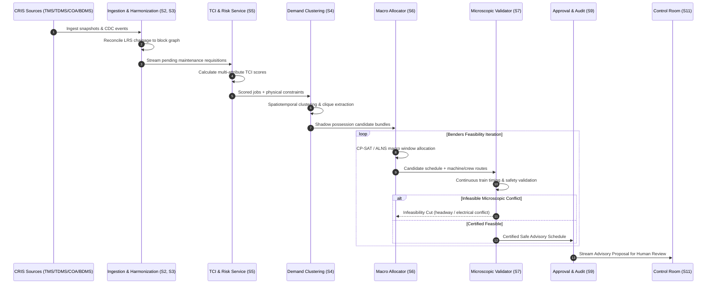
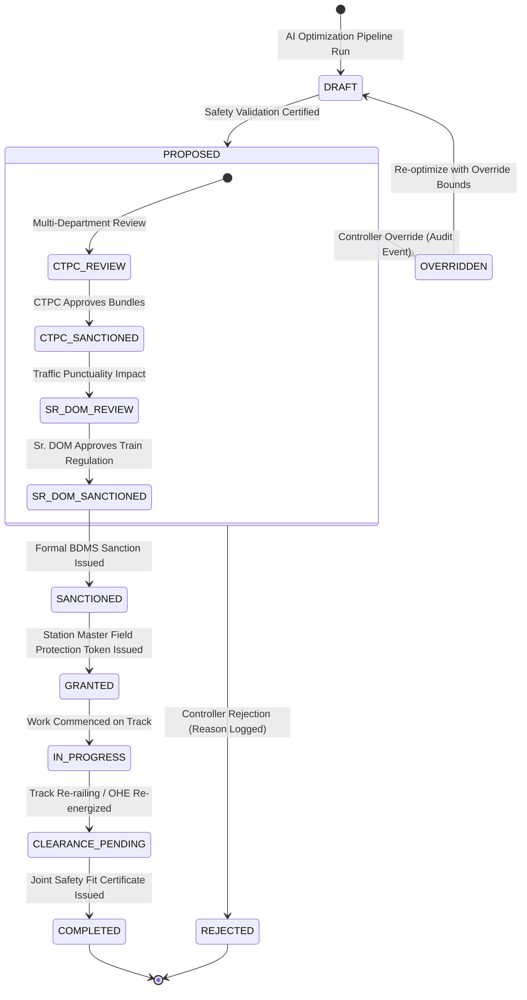

# SparkRail Target System Architecture

**Document Version:** 1.0.0  
**Target Platform:** Production-Ready, BDMS-Layered AI Optimization Advisory Platform  
**Governing Standard:** Indian Railways General & Subsidiary Rules (G&SR), Block Working Manual

---

## 1. Architectural Philosophy & Non-Negotiable Boundaries

SparkRail is engineered strictly as an **advisory decision support layer** operating on top of the Centre for Railway Information Systems (CRIS) Block & Disconnection Management System (BDMS).

```
+-------------------------------------------------------------------------+
|                       NON-NEGOTIABLE SAFETY BOUNDARIES                  |
+-------------------------------------------------------------------------+
| 1. NEVER directly operate switches or interlockings                     |
| 2. NEVER directly clear or command railway signals                      |
| 3. NEVER bypass the statutory BDMS approval chain                       |
| 4. NEVER automatically revoke an active GRANTED possession               |
| 5. NEVER silently override a local zonal or divisional rule              |
| 6. NEVER present an unvalidated or infeasible schedule as executable    |
+-------------------------------------------------------------------------+
```

Under Indian Railways statutory operating rules, physical track possession grants require human authorization from the Chief Track Possession Controller (CTPC), Senior Divisional Operations Manager (Sr. DOM), Section Controller, and the physical token/protection verification of the Station Master. SparkRail generates mathematically certified, safety-validated advisory proposals that feed into this statutory chain.

---

## 2. High-Level Modular Service Architecture

The system is decomposed into 11 modular services designed to operate cohesively within a unified repository before being partitioned across distributed infrastructure:



---

## 3. The 11 Core Platform Services

### Service 1: API Gateway and Governance Service
- **Role:** Single ingress point for operator web applications, external API consumers, and administrative tooling.
- **Responsibilities:**
  - Request ID tracking (`X-Request-ID`) and distributed tracing context propagation.
  - Granular Role-Based Access Control (RBAC) across Engineering, Operating, S&T, Electrical, and Admin roles.
  - mTLS certificate verification for external CRIS integration and JWT token validation for interactive users.
  - Idempotency key tracking on proposal submissions and approval actions.
  - Security header injection and request/response schema validation.

### Service 2: Ingestion and Event Mesh Service
- **Role:** High-throughput data ingestion interface decoupling external CRIS systems from the analytical engine.
- **Responsibilities:**
  - Standardized `SourceAdapter` protocol implementation across TMS, TDMS, SMMS, COA, RTIS, and BDMS.
  - Support for multi-mode execution: `SYNTHETIC`, `REPLAY`, and `LIVE` modes.
  - Kafka consumer management with dead-letter queue (DLQ) isolation for malformed payloads.
  - Source freshness monitoring and stale-data alerting (>5 minutes threshold).
  - Strict isolation: live mode strictly forbids fallback to synthetic data.

### Service 3: Data Harmonization and Linear Referencing Service
- **Role:** Spatial and topological reconciliation engine bridging disparate railway referencing systems.
- **Responsibilities:**
  - Linear Referencing System (LRS): translates continuous kilometer chainage (TMS) to discrete block sections (COA/BDMS).
  - Multi-graph construction:
    - **Physical Adjacency Multigraph:** Track sections, switches, stations, loops, crossovers.
    - **Electrical Dependency Graph:** 25kV AC feeding posts, sub-stations, elementary sections, isolator switches.
    - **Signalling Dependency Graph:** Signals, track circuits, route locking tables, axle counters.
  - RTIS GPS coordinate projection onto active corridor centerlines.
  - Ambiguity detection, mapping confidence scoring, and rejection of un-reconcilable geometry.

### Service 4: Demand Clustering and Conflict Graph Service (Optimization Tier 1)
- **Role:** Spatiotemporal preprocessing and multi-department maintenance candidate extraction.
- **Responsibilities:**
  - Spatiotemporal distance metric calculation: chainage distance, time window overlap, block containment, and elementary section overlap.
  - Compatibility hypergraph construction: excludes forbidden concurrent work types (e.g., OHE power isolation vs. S&T live testing).
  - Bron-Kerbosch maximal clique extraction to generate multi-department **Shadow Possession Bundles**.
  - Outputs candidate bundles with primary/secondary jobs, spatial limits, time envelopes, and compatibility rationales.

### Service 5: TCI and Asset Risk Service
- **Role:** Algorithmic prioritization of pending maintenance requisitions based on multi-attribute risk.
- **Responsibilities:**
  - Computes normalized (0-100) Task Criticality Index:
    $$TCI(job) = w_{safety} \cdot SafetyRisk + w_{delay} \cdot DelayImpact + w_{deg} \cdot DegradationVelocity + w_{overdue} \cdot OverduePenalty$$
  - Ingests USFD ultrasonic flaw detection records, IMR classifications, track geometry car measurements (twist, gauge).
  - Evaluates network centrality, train density, bypass availability, and passenger express criticality.
  - Implements nonlinear overdue escalation tied to mandated Rolling Block Programme (RBP) cycles.
  - Explainability generation detailing exact mathematical factor contributions for every requisition.

### Service 6: Macro Possession Allocator (Optimization Tier 2)
- **Role:** Medium-term corridor window and resource reservation engine.
- **Responsibilities:**
  - Formulated as a constraint programming model using OR-Tools CP-SAT with deterministic ALNS fallback.
  - Adaptive Large Neighborhood Search (ALNS) operators:
    - Destruction: worst-delay removal, corridor sweep removal, random perturbation.
    - Repair: regret-3 reinsertion, shadow-bundle insertion, machine relocation repair, frozen-window preservation.
  - Allocates macro possession windows across corridor sections while respecting:
    - Heavy track machine routing (BCM, Tie Tamper, Dynamic Track Stabilizer).
    - Maintenance crew shift durations (max 8 hours) and mandatory rest (12 hours).
    - Frozen Week 1 immutability.
    - Premium train (Vande Bharat, Rajdhani, Shatabdi) throughput protection.

### Service 7: Microscopic Dispatch Validator (Optimization Tier 3)
- **Role:** High-fidelity simulation and validation of continuous train movements and safety invariants.
- **Responsibilities:**
  - Microscopic verification of train trajectories, safe braking distances, and block headways.
  - Validates Temporary Single Line (TSL) operation on double-track sections, including pilotman authorization and 15/25 km/h restrictions.
  - Enforces OHE elementary-section electrical isolation: prohibits electric locomotives from entering unpowered blocks.
  - Validates station loop meet feasibility for train crossings and overtakes.
  - **Benders-style Decomposition:** Detects microscopic infeasibilities and generates named constraint cuts back to Tier 2 until a certified safe schedule is reached.

### Service 8: Dynamic Disruption Rescheduler
- **Role:** Rapid localized replanning in response to operational perturbations.
- **Responsibilities:**
  - Event-driven trigger: activates when train delay $\ge 15$ min, machine breaks down, weather worsens, or RTIS data becomes stale.
  - Localized corridor radius extraction: confines rescheduling to the affected division or section.
  - **Immutability Invariant:** `GRANTED` and `IN_PROGRESS` possessions are strictly immutable and cannot be cancelled or truncated.
  - Right-shifts `SANCTIONED` but unstarted possessions within permissible tolerance windows.
  - Regulates lower-priority freight trains or directs traffic to relief loops.
  - Benchmark performance target: localized advisory reschedule in $<90$ seconds.

### Service 9: Schedule Approval and Audit Service
- **Role:** Multi-tier statutory workflow management and tamper-evident audit logging.
- **Responsibilities:**
  - Formulates outbound BDMS advisory proposals (`POST /api/v1/optimization/possession-schedule`).
  - Manages statutory sign-off state machine:
    $$\text{DRAFT} \longrightarrow \text{PROPOSED} \longrightarrow \text{SANCTIONED} \longrightarrow \text{GRANTED} \longrightarrow \text{COMPLETED}$$
  - Captures digital approvals from CTPC, Sr. DOM, Section Controller, and Station Master.
  - Enforces operational override protocols requiring structured reason codes and supervisory authorization.
  - Maintains append-only audit trail capturing every system recommendation, user interaction, and approval decision.

### Service 10: KPI and Observability Service
- **Role:** Real-time metrics calculation, baseline comparison, and operational telemetry.
- **Responsibilities:**
  - Computes core Indian Railways performance indicators:
    - Block Utilization Efficiency (BUE)
    - Shadow Block Ratio (SBR)
    - Integrated Shadow Possession Execution Rate
    - Effective Track Machine Productivity Ratio
    - Downstream Delay per Block Hour
    - Maintenance Demand Fulfillment Ratio
    - Rolling Horizon Planning Adherence
    - Punctuality Impact Index (PII)
    - Mean Time to Grant (MTTG)
  - Compares manual baseline, AI recommendation, approved schedule, and actual field execution.
  - Exposes Prometheus-compatible operational health metrics (`/metrics`).

### Service 11: Operations Control Room Frontend
- **Role:** Web-based operational visualization and human-in-the-loop decision interface.
- **Responsibilities:**
  - Interactive multi-track Gantt Block Planner with shadow possession bundle inspection.
  - Zero-invention 3D WebGL scene displaying physical tracks, stations, elementary power sections, signals, and live trains.
  - Accessible high-contrast 2D linear schematic view with dynamic corridor length scaling and screen-reader tables.
  - Proposal review drawer with role-based sign-off controls, override recording, and side-by-side schedule comparison.
  - Prominent advisory safety status banners and real-time telemetry freshness indicators.

---

## 4. End-to-End Operational Flows

### 4.1 Data & Optimization Pipeline Flow


### 4.2 Statutory Human Approval Flow


---

## 5. Safety Boundaries & Failure Recovery Modes

### 5.1 Hard Invariant Failure Handling
If any safety invariant is violated during optimization or execution:
1. The optimization pipeline immediately halts processing of the offending candidate.
2. An explicit `SafetyViolationError` is raised with the exact invariant clause (e.g., `HEADWAY_VIOLATION`, `ELECTRICAL_ISOLATION_CONFLICT`, `CREW_REST_BREACH`).
3. The system rolls back to the **Last Known Safe Schedule (LKSS)**.
4. The proposal state is set to `SAFETY_REJECTED` and an audit event is logged.
5. The frontend displays an alert banner explaining the exact safety constraint that prevented execution.

### 5.2 Operating Modes Matrix

| Operating Mode | Data Source | Solver Engine | Outbound BDMS Calls | Operator Action |
| :--- | :--- | :--- | :--- | :--- |
| **`SYNTHETIC`** | Local deterministic corridor generator | Local CP-SAT / MILP / Heuristic | Disabled (mock internal) | Development, unit testing, and UI demonstration |
| **`REPLAY`** | Historical CRIS event log archive | Deterministic pipeline | Disabled (read-only audit) | Post-hoc analysis, KPI calibration, model validation |
| **`SHADOW_MODE`** | Live CRIS feeds (TMS, TDMS, COA, RTIS) | Production 3-tier pipeline | Disabled (passive observation) | Live parallel evaluation against manual decisions |
| **`ADVISORY_MODE`** | Live CRIS feeds | Production 3-tier pipeline | Enabled (dry-run / approved proposals) | Live pilot deployment with statutory approval sign-off |
