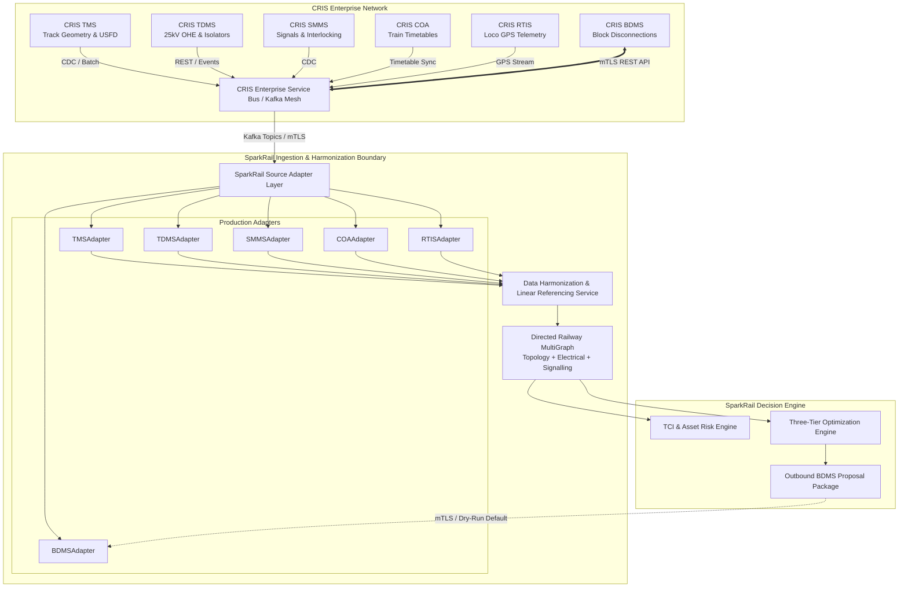
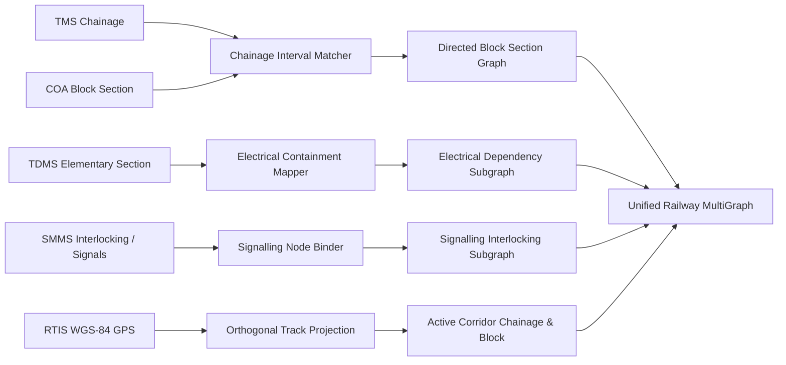

# CRIS Integration Architecture & Adapter Specifications

**Document Version**: 2.0.0  
**Target Systems**: Centre for Railway Information Systems (CRIS) Enterprise Suite:
- **TMS**: Track Management System (Civil Engineering)
- **TDMS**: Traction Distribution Management System (Electrical / TRD)
- **SMMS**: Signalling Maintenance Management System (S&T)
- **COA**: Control Office Application (Operating Department Timetables)
- **RTIS**: Real-Time Train Information System (Locomotive GPS Telemetry)
- **BDMS**: Block & Disconnection Management System (Statutory Possession Approvals)

---

## 1. Enterprise Integration Topology

SparkRail interfaces with Indian Railways CRIS infrastructure via an event-driven, decoupled integration mesh. It utilizes a combination of **Apache Kafka Event Streams** for high-velocity telemetry and **mTLS REST Adapters** for statutory transactional workflows.



---

## 2. Source Adapter Contract (`SourceAdapter` Protocol)

Every source adapter conforms to the canonical Python typing protocol defined in [`src/data_pipeline/adapters/base.py`](file:///c:/Users/Chand/Documents/New%20folder/sparkrail/sparkrail/src/data_pipeline/adapters/base.py):

```python
class SourceAdapter(Protocol):
    def health(self) -> SourceHealth:
        """Returns connection health, latency, and certificate validity."""
        ...

    def fetch_snapshot(self, request: SnapshotRequest) -> SnapshotResponse:
        """Pulls a consistent historical or current domain snapshot."""
        ...

    def consume_events(self, request: EventSubscription) -> Iterator[SourceEvent]:
        """Streams real-time events over Kafka topics or polling intervals."""
        ...
```

### Adapter Implementations Matrix

| Adapter Class | Target CRIS System | Primary Data Payload | Ingestion Mode | Fallback Strategy |
|:---|:---|:---|:---|:---|
| `SyntheticAdapter` | In-Memory Generator | Full Division Network (Track, Trains, Jobs) | On-Demand Synthetic | Deterministic PRNG Seed |
| `FixtureAdapter` | Local JSON/YAML | Test scenario mocks (Frozen Week 1, Disruption) | Static File | Validation Error if missing |
| `ReplayAdapter` | Historical Event Log | Timestamped RTIS & COA replay sequences | Historical Timeline Playback | Loop or Halt at EOF |
| `TMSAdapter` | CRIS TMS | Track condition, USFD flaws, IMR, track line | Daily Batch / REST | Cached Snapshot |
| `TDMSAdapter` | CRIS TDMS | 25kV OHE elementary sections, feeding posts | REST / Event Stream | Static Electrical Asset Map |
| `SMMSAdapter` | CRIS SMMS | Point machines, track circuits, route locks | CDC / Polling (60s) | Prior Interlocking Model |
| `COAAdapter` | CRIS COA | Master train timetable, consist, priority | Hourly Sync / REST | Daily Master Plan |
| `RTISAdapter` | CRIS RTIS | Locomotive GPS (lat/long), speed, timestamp | High-Frequency Kafka (5s) | Stale flag after 300s |
| `BDMSAdapter` | CRIS BDMS | Possession requests, sanctions, grant status | Bidirectional mTLS REST | Dry-run proposal buffering |

---

## 3. Configuration & Security Specification

Configuration is managed via external environment variables and the central [`SystemConfig`](file:///c:/Users/Chand/Documents/New%20folder/sparkrail/sparkrail/src/data_pipeline/models.py). Production credentials must **never** be committed to source control.

### Example Production Adapter Configuration

```json
{
  "source_system": "CRIS_BDMS",
  "base_url": "https://bdms.cris.org.in/api/v1",
  "mtls": {
    "enabled": true,
    "cert_path": "/etc/ssl/certs/sparkrail_client.crt",
    "key_path": "/etc/ssl/private/sparkrail_client.key",
    "ca_bundle_path": "/etc/ssl/certs/cris_root_ca.crt"
  },
  "kafka": {
    "bootstrap_servers": ["kafka1.cris.railnet.gov.in:9092", "kafka2.cris.railnet.gov.in:9092"],
    "topic": "cris.bdms.possession.events",
    "consumer_group": "sparkrail-optimizer-pryj",
    "division_partition_key": "PRYJ"
  },
  "resilience": {
    "timeout_seconds": 10.0,
    "max_retries": 3,
    "backoff_factor": 1.5,
    "dead_letter_target": "/var/log/sparkrail/dlq/bdms_failed_events.jsonl"
  },
  "governance": {
    "dry_run_default": true,
    "outbound_enabled": false
  }
}
```

### Security & Fault-Tolerance Principles
- **Strict mTLS Validation**: All HTTPS requests enforce TLS 1.3 with mandatory client authentication and verification against the Indian Railways Root Certificate Authority.
- **Bounded Exponential Backoff**: Transient network dropouts retry with jitter up to 3 times ($T_{\text{wait}} = \text{base} \times 1.5^{\text{attempt}}$).
- **Dead-Letter Logging**: Unparsable or schema-violating records are quarantined into a structured Dead-Letter Queue (DLQ) file with complete error lineage, preventing pipeline halt.
- **Dry-Run Default**: Outbound mutations to BDMS are disabled by default. When active, every proposal requires a cryptographically secure, unique `Idempotency-Key` UUID.

---

## 4. Canonical Spatial Harmonization & Linear Referencing

Different CRIS systems use differing coordinate and spatial referencing conventions:
- **TMS**: Kilometer post chainage (e.g., `KM 820/12 to 822/04`, Up Line).
- **COA**: Station codes and discrete block section names (e.g., `SFG-MJA-UP`).
- **TDMS**: Elementary section numbers (e.g., `ES-204-1A`) referencing feeding posts and isolators.
- **RTIS**: WGS-84 geographic coordinates (`Latitude`, `Longitude`, `Altitude`).

### Harmonization Pipeline Workflow

The [`DataHarmonizationPipeline`](file:///c:/Users/Chand/Documents/New%20folder/sparkrail/sparkrail/src/data_pipeline/harmonization.py) resolves these into a unified topological graph:



### Linear Referencing Safety Rules
1. **Ambiguity Rejection**: If a TMS chainage range overlaps multiple non-contiguous block sections without clear switch orientation, the asset is rejected with an ambiguous mapping error.
2. **Orthogonal RTIS Projection**: WGS-84 coordinates are projected onto the centerline polyline. If the orthogonal distance exceeds $50.0\text{ meters}$, the GPS fix is flagged as off-corridor and rejected.
3. **Data Provenance Preservation**: Every unified node and edge in the `RailwayMultiGraph` records its source system, source record ID, confidence score (0.0 to 1.0), and ingestion timestamp.

---

## 5. Outbound BDMS Advisory Proposal Contract

Advisory block recommendations submitted to BDMS adhere strictly to the JSON schema defined in [`src/api/advisory.py`](file:///c:/Users/Chand/Documents/New%20folder/sparkrail/sparkrail/src/api/advisory.py):

```json
{
  "optimization_run_id": "opt-20260904-214500-pryj",
  "division_code": "PRYJ",
  "planning_window": {
    "start_time": "2026-09-05T00:00:00Z",
    "end_time": "2026-09-05T23:59:59Z"
  },
  "schema_version": "1.0.0",
  "solver_mode": "CP_SAT_OPTIMAL",
  "safety_status": "VALIDATED_PASS",
  "approval_status": "PROPOSED",
  "recommended_blocks": [
    {
      "bundle_id": "BUNDLE-ENG-OHE-B3",
      "primary_job_id": "JOB-ENG-0821",
      "secondary_job_ids": ["JOB-OHE-0412"],
      "block_id": "B3",
      "start_time": "2026-09-05T02:30:00Z",
      "end_time": "2026-09-05T06:30:00Z",
      "electrical_isolation_required": true,
      "isolated_elementary_sections": ["ES-B3-UP"],
      "assigned_machines": ["BCM-353"],
      "assigned_crews": ["CREW-TRD-01", "CREW-ENG-04"]
    }
  ],
  "train_regulation_plan": [
    {
      "train_id": "T12401",
      "train_name": "Magadh Express",
      "priority": "EXPRESS",
      "scheduled_departure": "2026-09-05T03:15:00Z",
      "regulated_departure": "2026-09-05T03:45:00Z",
      "planned_delay_minutes": 30.0,
      "regulation_loop": "SFG-LOOP-2"
    }
  ],
  "audit_metadata": {
    "created_by": "SPARKRAIL_AI_TIER2",
    "created_at": "2026-09-04T21:45:12Z",
    "algorithm_version": "2.1.0-bdms"
  }
}
```
