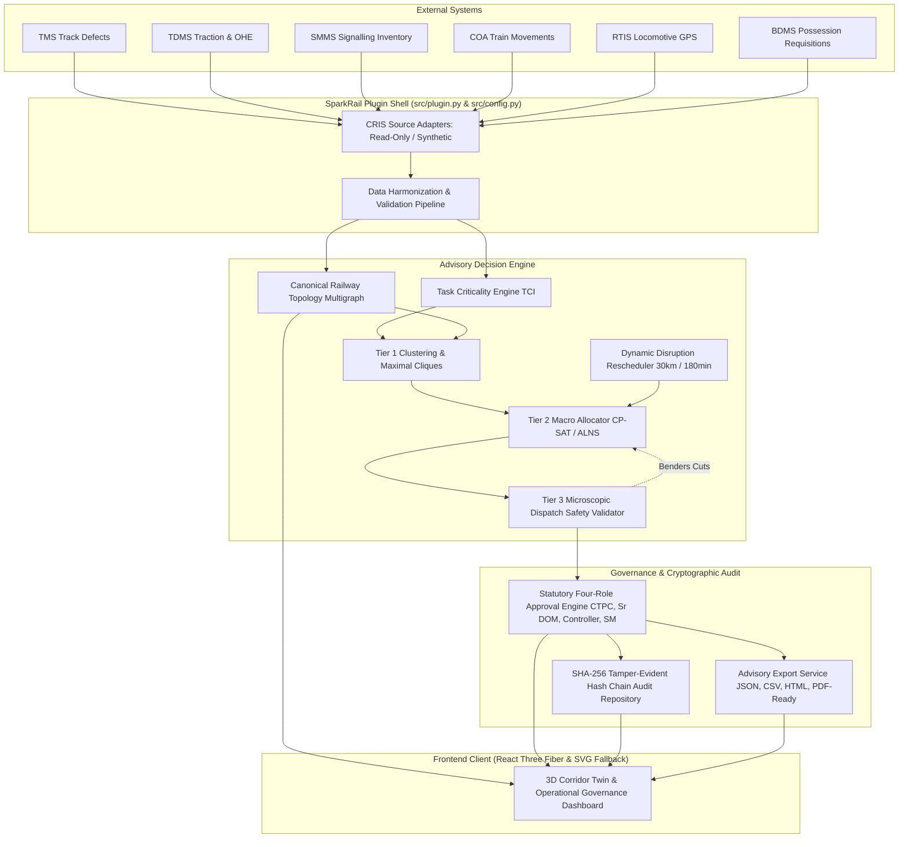

# SparkRail Day-One Plugin Architecture

## 1. Executive Summary & Plugin Positioning

**SparkRail** is a decision-support and maintenance planning advisory plugin for electrified railway corridors. In its Day-One deployment configuration for the Northern Central Railway (NCR) Prayagraj Division (Subedarganj `SFG` to Mirzapur `MZP`, 80 km electrified double-line corridor), SparkRail operates in **SHADOW MODE** alongside existing Indian Railways systems (BDMS, TMS, TDMS, SMMS, COA, and RTIS).

SparkRail **does not issue physical railway commands**. It ingests read-only or synthetic operational data, performs multi-attribute task criticality scoring (TCI), executes multi-department shadow possession bundling (Tier 1), computes conflict-free macro corridor schedules (Tier 2), validates microscopic railway safety invariants (Tier 3), renders the corridor in 3D, and produces tamper-evident advisory schedules for human review.

---

## 2. Logical Module Architecture

---

## 3. Operational Modes & Gating

| Operational Mode | Configuration | Read-Only | Actuation Allowed | Description |
|---|---|---|---|---|
| **SYNTHETIC** (Default) | `SPARKRAIL_MODE=synthetic` | Yes | **NO** | Fully offline, deterministic synthetic data seeded from pseudo-random generators. Used for demonstrations, training, and benchmarking. |
| **SHADOW** | `SPARKRAIL_MODE=shadow` | Yes | **NO** | Consumes read-only feeds and static snapshots from BDMS/COA/TMS. Advisory outputs are reviewed offline. Zero field commands issued. |
| **LIVE** (Gated) | `SPARKRAIL_MODE=live` + `SPARKRAIL_LIVE_ENABLED=true` | Configurable | **NO** | mTLS-authenticated connections to CRIS APIs. Strictly gated; fails safe if credentials or certificates are absent. Actuation remains disabled. |

---

## 4. The 15 Target Architecture Modules

1. **Plugin Shell (`src/plugin.py`)**: Unified entrypoint, mode resolution, CLI operations (`generate-seed`, `run-api`, `verify-audit`).
2. **API Gateway (`src/api/main.py`)**: FastAPI application with versioned endpoints (`/api/v1/...`), CORS, request tracing, and health monitoring.
3. **Source Adapter Layer (`src/data_pipeline/adapters/cris_adapters.py`)**: Deterministic adapters for TMS, TDMS, SMMS, COA, RTIS, and BDMS with retry backoff, timeouts, and dead-letter queue.
4. **Data Harmonization Layer (`src/data_pipeline/harmonization.py`)**: Ingestion, schema validation (`1.0.0`), coordinate parsing, and deduplication.
5. **Canonical Railway Topology (`src/data_pipeline/topology.py`)**: Directed multigraph preserving UP/DOWN lines, loop connectivity, crossovers, interlocking zones, and TSL paths.
6. **Task Criticality Engine (`src/ai_ml/criticality_scorer.py`)**: Multi-attribute TCI calculation scoring safety risk, capacity impact, degradation velocity, and overdue penalties.
7. **Tier 1 Clustering Engine (`src/optimization/clustering.py`)**: Compatibility hypergraph and Bron-Kerbosch maximal clique extraction for shadow possession bundling.
8. **Tier 2 Macro Allocator (`src/optimization/macro_allocator.py`)**: OR-Tools CP-SAT formulation with deterministic ALNS fallback, enforcing crew and machine availability.
9. **Tier 3 Microscopic Safety Validator (`src/optimization/microscopic_validator.py`)**: Block headway checking, electrical isolation exclusion, opposing TSL train detection, and HOER rest compliance.
10. **Disruption Replay Engine (`src/optimization/disruption_engine.py`)**: Localized 30 km / 180 min replanning triggered by >=15 min delays, preserving `GRANTED` and `IN_PROGRESS` work.
11. **Governance & Approval Service (`src/api/advisory.py`)**: Statutory 4-role sign-off (`CTPC`, `SR_DOM`, `SECTION_CONTROLLER`, `STATION_MASTER`) with optimistic concurrency.
12. **Audit Service (`src/api/advisory.py`)**: SHA-256 cryptographic tamper-evident audit chain with continuous verification.
13. **KPI & Observability Service (`src/simulation/evaluator.py`)**: Block Utilization Efficiency (BUE), Shadow Block Ratio (SBR), and Punctuality Impact Index (PII).
14. **3D Digital Twin Frontend (`frontend/`)**: React Three Fiber 3D corridor visualization with level of detail, instanced rendering, timeline replay, and accessible 2D SVG fallback.
15. **Export & Integration Service (`src/api/export_service.py`)**: Multi-format advisory export in JSON, CSV, printable HTML docket, and PDF-ready layout.
