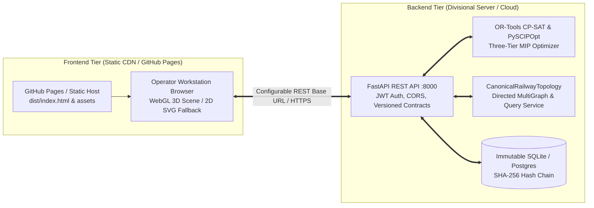

# SparkRail Production Deployment Guide

**Architecture Model:** Decoupled Static Frontend (GitHub Pages Compatible) + Resilient Backend Services  
**Target Platform:** Indian Railways Operations Decision Support  
**Version:** 1.0.0  

---

## 1. Overview & Architectural Decoupling

SparkRail is architected into two independently deployable tiers:

1. **Static Frontend Client:**
   - Pure client-side bundle (HTML5, JavaScript, CSS, WebGL).
   - Can be hosted on **GitHub Pages**, AWS S3, Cloudflare Pages, or on-premise Nginx.
   - Operates in complete standalone offline simulation mode (`DEMO_MODE=true`) or connects to remote FastAPI backends.
   - Never contains embedded credentials, API tokens, or hardcoded operational secrets.
2. **Backend Services & Mathematical Solver:**
   - Containerized FastAPI application running Python 3.10+.
   - Hosts the OR-Tools / PySCIPOpt solver engines, canonical topology multigraph, CRIS adapters, and SQLite/PostgreSQL audit stores.
   - Deployed on dedicated railway divisional on-premise servers or GovCloud infrastructure.



---

## 2. Frontend GitHub Pages Deployment

### 2.1 Building the Static Bundle
The frontend build is configured with relative path resolution (`base: './'`), allowing it to be served from any subdirectory or custom domain:

```bash
cd frontend
npm install
npm run build
```

The output artifacts are written to `frontend/dist/`:
- `dist/index.html`
- `dist/assets/index-[hash].js`
- `dist/assets/index-[hash].css`
- `dist/favicon.svg`

### 2.2 GitHub Pages Publishing
1. Commit and push changes to GitHub.
2. Navigate to repository **Settings** $\to$ **Pages**.
3. Under **Build and deployment**, select **GitHub Actions** or choose the `gh-pages` branch pointing to the `frontend/dist` directory.
4. If using a custom base repository path (e.g. `https://chandrasekarc968-cpu.github.io/sparkrail/`), set the environment variable:
   ```bash
   VITE_BASE_PATH=/sparkrail/ npm run build
   ```

### 2.3 Configuring Backend URL at Runtime
Operators can dynamically point the static frontend to their divisional backend without rebuilding:
- **Via UI:** In the control room header or settings drawer.
- **Via Developer Console / LocalStorage:**
  ```javascript
  localStorage.setItem('sparkrail_api_url', 'https://divisional-gateway.pryj.railnet.gov.in:8000');
  localStorage.setItem('sparkrail_demo_mode', 'false'); // Switch to live backend
  location.reload();
  ```

---

## 3. Backend Deployment

### 3.1 System Prerequisites
- **Operating System:** Linux (Ubuntu 22.04 LTS / RHEL 9) or Windows Server 2022
- **Python:** 3.10 or 3.11
- **Solver Libraries:** SCIP 8.0+ / OR-Tools 9.8+

### 3.2 Installation & Startup
```bash
# Clone repository
git clone https://github.com/chandrasekarc968-cpu/sparkrail.git
cd sparkrail

# Create virtual environment
python -m venv .venv
source .venv/bin/activate  # Or on Windows: .venv\Scripts\Activate.ps1

# Install dependencies
pip install -r requirements.txt

# Run backend test suite
python -m pytest

# Start production API server
uvicorn src.api.main:app --host 0.0.0.0 --port 8000 --workers 4 --proxy-headers
```

### 3.3 Production Environment Variables (`.env`)
```ini
# Platform Operation Mode
DATA_MODE=synthetic_pilot          # Options: synthetic_pilot, live_production
LIVE_MODE_ENABLED=false           # Safety boundary: live mode disabled by default

# API & Security
API_SECRET_KEY=ChangeMeInProduction_UseVaultSecret
JWT_ALGORITHM=HS256
CORS_ORIGINS=https://chandrasekarc968-cpu.github.io,http://localhost:5173

# Solver Configuration
SOLVER_NAME=PySCIPOpt
SOLVER_MAX_SECONDS=60.0

# CRIS Integration (Configuration-Gated)
ENABLE_CRIS_DRY_RUN=true
TMS_ADAPTER_ENDPOINT=https://tms.cris.org.in/api/v1
BDMS_ADAPTER_ENDPOINT=https://bdms.cris.org.in/api/v1
```

---

## 4. Health Checks & Observability

The backend provides automated health checks for load balancers and orchestrators:

- **Endpoint:** `GET /health`
- **Response Contract:**
  ```json
  {
    "status": "ok",
    "version": "1.0.0",
    "geometry_schema_version": "1.0.0",
    "solver_available": true,
    "solver_name": "PySCIPOpt (MIP Solver)",
    "data_mode": "synthetic_pilot"
  }
  ```
- **Versioned Geometry Endpoint:** `GET /network/geometry/v1`
- **Topology Service Endpoint:** `GET /network/topology`

---

## 5. Asset Caching & Rollback Strategy

1. **Asset Caching:**
   - Static bundles (`dist/assets/*-[hash].js`, `css`) contain content hashes and should be cached with:
     `Cache-Control: public, max-age=31536000, immutable`
   - `index.html` must be served with:
     `Cache-Control: no-cache, no-store, must-revalidate`
2. **Rollback Procedure:**
   - **Frontend:** Re-deploy the previous Git commit artifact to GitHub Pages.
   - **Backend:** Maintain systemd service or Docker image tagging (`sparkrail:v1.0.0-previous`) for instantaneous zero-downtime rollback.
