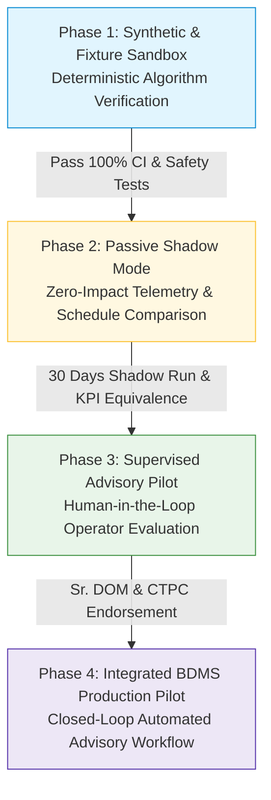

# Pilot Rollout & Phased Deployment Strategy

**Target Division**: Prayagraj Division (PRYJ), North Central Railway (NCR)  
**Pilot Corridor**: Subedarganj (SFG) to Mirzapur (MZP) Trunk Line (80 Route Kilometers)  
**Operational Context**: High-density double/triple-line mixed traffic corridor with Dedicated Freight Corridor (DFC) feeder connections.

---

## 1. Phased Pilot Architecture

To ensure zero disruption to live train operations and complete compliance with Indian Railways safety standards, SparkRail adopts a strict four-phase rollout roadmap.

---

## 2. Detailed Phase Specifications

### Phase 1: Synthetic & Fixture Sandbox (Current State: COMPLETED)
- **Objective**: Mathematically verify the Three-Tier Optimization Pipeline, TCI scoring formula, and safety constraint engine using deterministic test fixtures and synthetic corridor data.
- **Operations**: In-memory execution, 87+ automated test suites, end-to-end frontend simulation, zero external network dependencies.
- **Acceptance Gate**: 100% test pass rate, strict compliance with EN 50128 safety invariants, sub-second solver runtime on benchmark corridor.

### Phase 2: Passive Shadow Mode (Next Deployment Step)
- **Objective**: Ingest live or recorded Indian Railways telemetry (COA timetables, RTIS locomotive positions, TMS track flaws) without providing recommendations to live controllers.
- **Operations**:
  - SparkRail runs continuously in the background.
  - Generates recommended block schedules in a sandboxed database.
  - Automatically compares AI recommendations against the actual manual schedules sanctioned in BDMS.
  - Logs variance metrics: missed shadow block opportunities, excess train delay, and machine idle time.
- **Acceptance Gate**: 30 consecutive days of continuous operation with zero memory leaks, $\ge 99.5\%$ data ingestion uptime, and demonstrated potential for $>15\%$ reduction in overall corridor downtime.

### Phase 3: Supervised Advisory Pilot
- **Objective**: Expose the SparkRail React Control Room to the Prayagraj Division Block Coordination Room (Sr. DOM, CTPC, and Section Controllers) in advisory mode.
- **Operations**:
  - Outbound calls to BDMS remain in `dry_run = True` mode.
  - During the daily 14:00 hrs block planning meeting, controllers review the AI-suggested shadow bundles on the 3D / 2D interactive corridor display.
  - Controllers manually enter the accepted recommendations into BDMS.
- **Acceptance Gate**: Operator satisfaction score $>85\%$, zero safety rejections, confirmed reduction in planning meeting duration from 90 minutes to under 20 minutes.

### Phase 4: Integrated BDMS Production Pilot
- **Objective**: Establish bidirectional, automated mTLS coupling with the CRIS BDMS staging environment.
- **Operations**:
  - SparkRail pushes signed advisory proposal packages directly to BDMS via `POST /api/v1/optimization/possession-schedule`.
  - Proposals appear directly in the BDMS native inbox for CTPC and Sr. DOM electronic sign-off.
  - BDMS emits lifecycle webhook callbacks (`SANCTIONED`, `GRANTED`, `COMPLETED`) to keep SparkRail's digital twin synchronized in real time.
- **Acceptance Gate**: 90-day pilot on the SFG-MZP section achieving:
  - Shadow Block Ratio (SBR) $\ge 15\%$
  - Downstream Passenger Delay Reduction $\ge 20\%$
  - Zero safety violations or unapproved schedule executions.

---

## 3. Rolling Planning Horizons

SparkRail supports multi-tiered temporal planning horizons to match Indian Railways operating rhythms:

| Horizon Name | Duration | Primary Function | Re-Optimization Trigger |
|:---|:---|:---|:---|
| **Operational Tactical** | 24 Hours | Exact machine dispatch, crew shifts, train regulation | Real-time disruption ($\ge 15\text{ min}$ delay) |
| **Weekly Program** | 7 Days | Machine movement, ballast train pathing, Week 1 Freeze | Daily rolling rollover at 00:00 hrs |
| **Quarterly Overhaul** | 26 Weeks | Deep screening, turn-out renewals, bridge rehabilitation | Bi-weekly corridor maintenance review |
| **Annual Corridor Master** | 52 Weeks | Capital asset renewals, national freight corridor corridors | Annual divisional budget allocation |

---

## 4. Emergency Rollback & Safety Fallback

If at any point during Phase 3 or Phase 4 an unexpected anomaly occurs (e.g., communication timeout, solver non-convergence, or operator dispute):

1. **Advisory Decoupling**: With a single toggle in the control room (`Settings` $\to$ `Advisory Mode Disable`), the system severs outbound proposal transmission.
2. **Zero In-Flight Disruption**: Because SparkRail never directly actuates signals or switches, deactivating the system leaves field operations entirely under standard Indian Railways manual G&SR control.
3. **Preservation of Active Work**: All currently active `GRANTED` and `IN_PROGRESS` blocks continue unaffected under the authority of the Section Controller and Station Master.

---

## 5. Deployment Scope Disclaimer

> [!IMPORTANT]
> SparkRail is currently engineered and verified as **Pilot-Ready for Bounded Corridors** (e.g., Prayagraj Division SFG-MZP corridor). Claims of immediate national-scale deployment across all 70 divisions of Indian Railways are explicitly disclaimed. National scaling requires multi-datacenter Kubernetes clustering, dedicated CRIS ESB Kafka brokers, and official administrative clearance from the Railway Board.
