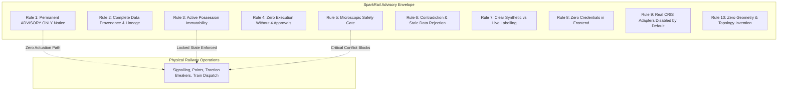

# SparkRail Plugin Safety Boundaries & Invariants

## 1. Safety Integrity Level & Architectural Positioning

SparkRail operates strictly at **Safety Integrity Level 0 (SIL-0) / Advisory Decision Support**. 
It is engineered as an offline, read-only decision aid for Indian Railways controllers and engineers.

Under Indian Railways General & Subsidiary Rules (G&SR) and Block Working Manuals, all statutory operational authority remains exclusively with human controllers:
- **CTPC**: Chief Traction Power Controller (Traction isolation authority)
- **Sr. DOM**: Senior Divisional Operations Manager (Divisional operational clearance)
- **Section Controller**: Train movement and block granting authority
- **Station Master**: Station limits and interlocking authority

---

## 2. The 10 Non-Negotiable Safety Invariants

### Invariant 1: Mandatory Advisory Notice
- Every UI screen, API payload, and export docket contains:
  `ADVISORY ONLY: HUMAN APPROVAL REQUIRED`
- Implemented in: `src/api/export_service.py`, `src/api/advisory.py`, `frontend/src/components/layout/GlobalHeader.tsx`.

### Invariant 2: Complete Entity Provenance
- Every entity displayed in the 3D digital twin or API carries:
  `source_system`, `source_record_id`, `schema_version`, `coordinate_reference_system`, `source_timestamp`, `ingestion_timestamp`, `data_freshness_seconds`, `confidence`, and `validation_status`.
- Implemented in: `src/data_pipeline/models.py`, `frontend/src/components/3d/PlanningInspector.tsx`.

### Invariant 3: Active Possession Immutability
- Possessions with status `GRANTED` or `IN_PROGRESS` cannot have their start/end times shifted, shortened, or cancelled.
- Any attempt to modify raises a `ValueError("Possessions in GRANTED/IN_PROGRESS status are strictly immutable")`.
- In the 3D scene, active possessions render with `🔒 IMMUTABLE ACTIVE` and drag/edit handles are disabled.
- Implemented in: `src/data_pipeline/models.py` (`Possession.modify_window`), `src/data_pipeline/geometry_validator.py`, `frontend/src/components/3d/MaintenanceBlockVolume.tsx`.

### Invariant 4: Statutory Four-Role Approval Barrier
- A recommendation can never be marked `SANCTIONED` or executable until all four roles (`CTPC`, `SR_DOM`, `SECTION_CONTROLLER`, `STATION_MASTER`) have signed off.
- If even one role rejects or remains pending, the recommendation remains in `PROPOSED` status.
- Implemented in: `src/api/advisory.py` (`approve_recommendation`).

### Invariant 5: Microscopic Safety Violation Gate
- If microscopic dispatch simulation (Tier 3) identifies any of:
  - Headway violations
  - Electric train occupying isolated OHE section
  - Opposing train conflicts on Temporary Single Line (TSL)
  - Station loop overflow
  - Crew HOER rest violations
  Then the proposal is tagged `CRITICAL CONFLICT`, displays `🚫 APPROVAL BLOCKED`, and cannot be approved.
- Implemented in: `src/optimization/microscopic_validator.py`, `frontend/src/components/3d/ConflictMarker.tsx`.

### Invariant 6: Rejection of Contradictory & Stale Data
- Events with timestamps older than previous records or violating physical constraints (e.g. two trains on same track section) are immediately rejected to `data/dead_letter.jsonl`.
- Data with freshness > 300s is visibly flagged with `⚠️ STALE TELEMETRY`.
- Implemented in: `src/data_pipeline/adapters/cris_adapters.py`, `frontend/src/components/3d/TimelineController.tsx`.

### Invariant 7: Clear Synthetic vs Live Distinction
- Synthetic data is tagged `is_synthetic: true` and rendered with a distinct `SYNTHETIC DEMO` badge.
- Live data indicators are only permitted when connected to an authenticated, verified source.
- Implemented in: `src/config.py`, `frontend/src/pages/ThreeDNetwork.tsx`.

### Invariant 8: Zero Frontend Credentials
- Frontend code and static bundles contain zero private keys, mTLS certs, or API secrets.
- All secure communication occurs backend-to-backend.
- Implemented in: `frontend/src/api/client.ts`.

### Invariant 9: Fail-Safe CRIS Adapter Defaults
- Live CRIS integration is disabled by default (`SPARKRAIL_MODE=synthetic`).
- If `SPARKRAIL_MODE=live` is configured without `SPARKRAIL_LIVE_ENABLED=true` and valid mTLS certificates on disk, the system halts with an error.
- Implemented in: `src/config.py`, `src/data_pipeline/adapters/cris_adapters.py`.

### Invariant 10: Zero Geometry & Topology Invention
- The 3D map and scheduler derive track connections exclusively from canonical multigraph topology.
- Missing or invalid tracks result in rejection, never interpolation of nonexistent railway assets.
- Implemented in: `src/data_pipeline/topology.py`, `src/data_pipeline/geometry_validator.py`.
