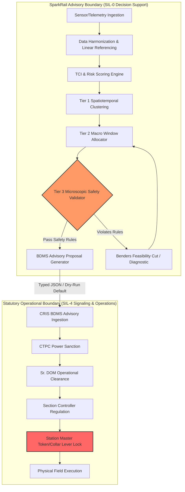
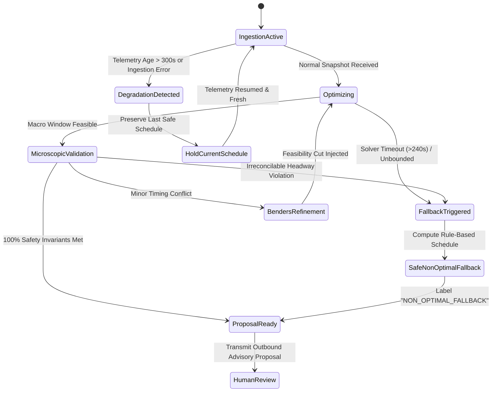

# SparkRail Safety Case & Formal Safety Invariants

**System Designation**: SparkRail AI-Powered Automatic Block Planning System  
**Safety Integrity Classification**: EN 50126 / EN 50128 SIL-0 Advisory Decision Support Layer  
**Target Deployment**: Layered Advisory Integration with Indian Railways CRIS BDMS  
**Applicable Standards**: Indian Railways General & Subsidiary Rules (G&SR), Manual for Track Maintenance (IRPWM), AC Traction Manual (ACTM), Signal Engineering Manual (IRSEM)

---

## 1. Safety Philosophy & Structural Invariants

SparkRail is explicitly designed as an **advisory decision-support platform**. It operates upstream of human dispatchers and the Indian Railways Block & Disconnection Management System (BDMS). 

### The Nine Critical Safety Boundaries
1. **Visualization & Decision Support Only**: The 3D map is strictly an advisory aid. It operates completely disconnected from field actuation.
2. **Zero Actuation Commands**: It must never issue signalling, point-machine, traction-breaker, or train-dispatch commands.
3. **Zero-Invention Geometry**: The map must never invent geometry, track connections, stations, signals, OHE sections, train paths, or possession boundaries. Missing or invalid geometry is visibly rejected.
4. **Mandatory Provenance**: Every displayed object must declare `source_system`, `source_record_id`, `schema_version: "1.0.0"`, `confidence`, `source_timestamp`, `ingestion_timestamp`, `data_freshness_seconds`, and `validation_status`.
5. **Visible Degradation**: Invalid, stale, incomplete, or contradictory geometry must be visibly flagged with high-contrast warning badges and must never appear as trusted operational data.
6. **Active Possession Immutability**: `GRANTED` and `IN_PROGRESS` possessions must be visibly locked (`🔒 IMMUTABLE ACTIVE`) and cannot be moved or dragged through the UI.
7. **Statutory Approval Enforcement**: A recommendation must never appear executable before all required statutory approvals (`CTPC` $\to$ `Sr. DOM` $\to$ `Section Controller` $\to$ `Station Master`) are complete.
8. **Explicit Synthetic Labelling**: Synthetic data must be visibly and unambiguously labelled as synthetic. It must never be presented as live railway telemetry.
9. **Authoritative Geographic Lineage**: Geographic accuracy is never claimed unless coordinates possess a validated Coordinate Reference System (`EPSG:4326` or `LOCAL_CORRIDOR`) and verifiable source lineage.

---

## 2. Formal Mathematical Safety Constraints

Every proposed possession $P_i$ and train movement $T_k$ is subjected to the following formal hard constraints:

### Constraint 1: 25kV AC OHE Electrical Isolation & Electric Traction Exclusion
When an electrical elementary section $e \in \mathcal{E}$ is isolated for maintenance during window $[S_i, E_i]$:
$$\forall t \in [S_i, E_i], \quad \text{IsolatorState}(e, t) = \text{OPEN}$$
For any train movement $T_k$ utilizing electric traction ($\text{TractionType}(T_k) = \text{ELECTRIC}$):
$$\text{Trajectory}(T_k, t) \cap \text{Track}(e) = \emptyset, \quad \forall t \in [S_i - \Delta_{\text{margin}}, E_i + \Delta_{\text{re-energize}}]$$
*Parameter Standard*: $\Delta_{\text{margin}} = 10\text{ min}$, $\Delta_{\text{re-energize}} = 10\text{ min}$.

### Constraint 2: S&T Signaling Disconnection & Interlocking Route Locking
When S&T maintenance occurs on block section $b_j$ or interlocking node $v_m$:
- All conflicting routes $\mathcal{R}_{\text{conflict}}(v_m)$ are locked in the `REJECT` state.
- Track circuits within the block section report occupied:
$$\text{SignalState}(s, t) = \text{RED (Danger)}, \quad \forall s \in \text{Signals}(b_j), \forall t \in [S_i, E_i]$$
- Opposing and following train approach locking is enforced at distant signal caution markers.

### Constraint 3: Minimum Headway Enforcement
For any two consecutive trains $T_k$ and $T_{k+1}$ operating in the same direction along track segment $seg$:
$$\text{EntryTime}(T_{k+1}, seg) - \text{EntryTime}(T_k, seg) \ge H_{\text{min}}(seg, \text{BlockSignaling})$$
*Rule Parameters*:
- Absolute Block: Minimum 1 station section clearance (approx. 10 to 15 minutes).
- Automatic Block Signaling (ABS): Minimum 4-aspect signal clearance ($H_{\text{min}} = 5\text{ minutes}$).

### Constraint 4: Temporary Single-Line Working (TSL) Opposing Exclusion
When maintenance closes one line of a double-line corridor, the remaining active line $seg_{\text{active}}$ operates under Temporary Single-Line Working (TSL):
$$\text{Dir}(T_a) \neq \text{Dir}(T_b) \implies [T_a^{\text{start}}, T_a^{\text{exit}}] \cap [T_b^{\text{start}}, T_b^{\text{exit}}] = \emptyset$$
Furthermore, a mandatory clearance buffer $\Delta_{\text{TSL}} = 15\text{ minutes}$ is enforced between opposing train passages for Pilot Guard token exchange.

### Constraint 5: Track Machine Exclusivity & Safe Staging
High-output mechanized track maintenance equipment (e.g., Plasser & Theurer BCM 353, CSM 09-32) require exclusive block possession:
$$\text{MachineCount}(b_j, t) \le 1 \quad \text{for heavy tamping / ballast screening}$$
Travel and setup times must adhere to:
$$S_i \ge \text{DepTime}(M_m, \text{StagingLoop}) + \frac{\text{Distance}(\text{StagingLoop}, b_j)}{V_{\text{machine}}}$$
$$V_{\text{machine}} \le 30\text{ km/h (self-propelled)}, \quad 40\text{ km/h (hauled)}$$

### Constraint 6: Crew Shift & Mandatory Rest Limits
Per the Indian Railways Hours of Employment Regulations (HOER):
$$\text{ShiftDuration}(C_c) = \text{ShiftEnd}(C_c) - \text{ShiftStart}(C_c) \le 12.0\text{ hours}$$
$$\text{ContinuousNightWork}(C_c) \le 2\text{ consecutive nights}$$
$$\text{RestPeriod}(C_c) \ge 16.0\text{ hours (following 12h duty)}$$

### Constraint 7: Premium Passenger Train Protection Bound
To preserve the statutory punctuality index for Vande Bharat, Rajdhani, and Shatabdi Express services:
$$\text{Delay}(T_{\text{premium}}) = t_{\text{actual}}^{\text{arrival}} - t_{\text{scheduled}}^{\text{arrival}} \le 60.0\text{ minutes}$$
Any maintenance macro candidate causing $\text{Delay}(T_{\text{premium}}) > 60\text{ min}$ is automatically cut and pruned by the optimizer.

---

## 3. Failure Recovery State Machine

---

## 4. Hazard Mitigation Log

| Hazard ID | Hazard Description | Causal Factor | Potential Operational Impact | SparkRail Mitigation Architecture | Verification Method |
|:---|:---|:---|:---|:---|:---|
| **HAZ-001** | Electric train routed into isolated OHE section | Erroneous block scheduling or missing TDMS feeding post mapping | Electric arc, pantograph entanglement, catastrophic grid fault | Tier 3 validator explicitly verifies `TractionType` vs `ElementaryElectricalSection` isolation status with mandatory 10-min safety buffer. | `tests/test_safety_constraints.py::test_ohe_elementary_section_isolation` |
| **HAZ-002** | Simultaneous opposing trains on single line during TSL | Incomplete interlocking modeling during single-line diversion | Head-on collision or station approach impasse | TSL conflict hypergraph strictly prunes opposing movements with a mandatory 15-minute pilot guard token margin. | `tests/test_safety_constraints.py::test_tsl_opposing_train_exclusion` |
| **HAZ-003** | Premature or unannounced possession cancellation | AI rescheduling engine attempting to minimize train delay | Track machines stranded; workers exposed on live line | Active `GRANTED` and `IN_PROGRESS` possessions are mathematically immutable; optimizer variables are clamped to $1$. | `tests/test_safety_constraints.py::test_active_granted_possession_immutability` |
| **HAZ-004** | Track machine collision during transit | Excessive speed or unsignaled entry into occupied block | Collision with rolling stock or derailment | Machine transit model checks staging loop availability, speed limits ($30\text{ km/h}$), and exclusive line clearance. | `tests/test_safety_constraints.py::test_machine_exclusivity_and_transit` |
| **HAZ-005** | Track maintenance crew fatigue incident | Machine operators or Gang Men exceeding HOER limits | Operational error, failure to display banner flags | Crew shift constraint blocks job allocation if total continuous shift $>12.0\text{ hr}$ or rest $<16.0\text{ hr}$. | `tests/test_safety_constraints.py::test_crew_shift_and_rest_limits` |
| **HAZ-006** | Stale GPS / RTIS positioning causing false clearance | Loss of GSM-R/4G locomotive telemetry | Schedule calculated on phantom train locations | Telemetry age monitor flags data $>300\text{s}$ as stale; engine freezes rescheduling and alerts section controller. | `tests/test_safety_constraints.py::test_stale_rtis_telemetry_handling` |
| **HAZ-007** | Invalid linear chainage referencing | Desynchronized track coordinates between TMS and COA | Possession granted at wrong kilometer post | Canonical linear referencing service validates km continuity, CRS, and raises validation error on ambiguity. | `tests/test_safety_constraints.py::test_chainage_mapping_validation` |

---

## 5. Conclusion and Operational Bounds

SparkRail does not replace Indian Railways G&SR or field-level interlocking. It enforces these safety rules computationally within its mathematical formulation to guarantee that **no advisory proposal produced by the AI can ever recommend an operationally unsafe course of action**.
