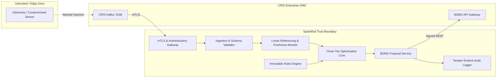

# SparkRail Threat Model & Cybersecurity Architecture

**Methodology**: STRIDE (Spoofing, Tampering, Repudiation, Information Disclosure, Denial of Service, Elevation of Privilege)  
**Scope**: SparkRail AI Advisory Optimization Layer, CRIS Ingestion Mesh, and BDMS Interface  
**Classification**: Mission-Critical Rail Transport Infrastructure Decision Support

---

## 1. System Boundary & Critical Assets

### Critical Information Assets
1. **Locomotive & Train Telemetry**: RTIS GPS positions, speed profiles, train priorities, and train consist data.
2. **Track & Infrastructure Health**: TMS ultrasonic rail flaw (USFD) records, IMR geometry data, and speed restrictions.
3. **Electrical & Signalling Topography**: TDMS 25kV OHE elementary section states and SMMS interlocking route locking rules.
4. **Advisory Schedules & Proposals**: Recommended possession windows, machine allocations, and train regulation plans.
5. **Operational Audit Trail**: Historical record of operator overrides, approvals, rejections, and system diagnostics.

---

## 2. STRIDE Threat Analysis & Implemented Mitigations

| Threat Vector | STRIDE Category | Threat Scenario | Impact Severity | SparkRail Mitigation Architecture |
|:---|:---|:---|:---|:---|
| **Poisoned Telemetry** | **Spoofing / Tampering** | Adversary injects false RTIS telemetry claiming a train is 20 km away from its real position. | **CRITICAL** | **Orthogonal Corridor Projection & Kalman Sanity Check**: RTIS GPS fixes are projected onto physical rail polyline; points with $>50\text{m}$ offset or velocity $>160\text{ km/h}$ acceleration jumps are rejected. |
| **Geometry Spoofing / Malformed CRS** | **Spoofing / Tampering** | Adversary injects invalid, infinite, or unmapped coordinates to mislead controllers or crash 3D scene. | **HIGH** | **Canonical Geometry Contract v1.0.0 Validator**: Reject any NaN/infinite coordinates, reversed chainage, zero-length tracks, unknown CRS (`LOCAL_CORRIDOR` or `EPSG:4326` only), or unlocked active possessions. |
| **Stale Telemetry** | **Tampering** | Network partition stalls RTIS/TMS updates; optimizer operates on expired train positions. | **HIGH** | **Strict Freshness Monitor**: All source events require ingestion timestamp. Data older than $300\text{ seconds}$ is flagged `STALE`, displaying warning banners and disabling unverified movement assumptions. |
| **Client-Side URL Injection** | **Information Disclosure / Tampering** | Malicious script or phishing link manipulates `localStorage` or URL query params to hijack API target. | **HIGH** | **Input Sanitization & Safe Defaults**: All user-configured API URLs are validated against protocol (`http://` or `https://`) and hostname patterns; credentials in URLs are strictly rejected. Live mode requires explicit operator opt-in. |
| **WebGL Shader Resource Exhaustion** | **Denial of Service** | Malicious payload generates 1,000,000 unique meshes to crash the browser GPU context. | **MEDIUM** | **Batched Instancing & Level-of-Detail (LOD)**: Repeated assets (masts, signals) use `THREE.InstancedMesh`; maximum label budget enforced; automatic fallback to Accessible 2D SVG schematic upon WebGL context loss. |
| **Replay Attacks** | **Repudiation / Spoofing** | Adversary replays an old approved possession payload to reopen a track block during live traffic. | **CRITICAL** | **Nonce & Timed Proposal Verification**: Every advisory proposal carries a unique `optimization_run_id`, a UTC timestamp, and requires an `Idempotency-Key` UUIDv4. Replayed messages are rejected by BDMS adapters. |
| **Unauthorized Approval** | **Elevation of Privilege** | An unauthenticated client or lower-tier role attempts to sanction or override a block schedule. | **CRITICAL** | **Role-Based Access Control (RBAC)**: All advisory endpoints enforce JWT bearer tokens. Actions are role-gated (`CTPC`, `SR_DOM`, `SECTION_CONTROLLER`). Anonymous calls fail with HTTP 403 Forbidden. |
| **Duplicate Proposal Submission** | **Tampering / DoS** | Network retries duplicate a proposal, causing double machine reservation or conflicting block requests. | **MEDIUM** | **Idempotent Proposal Handshake**: The BDMS adapter uses deterministic idempotency hashes derived from `(division, start_time, block_ids)`. Duplicate attempts return the existing cached proposal. |
| **Solver Tampering** | **Tampering** | Attacker modifies solver output JSON in transit to delete electrical isolation requirements. | **CRITICAL** | **Internal Pipeline Integrity**: Optimization runs in-process with immutable Pydantic dataclasses. Proposals are validated against independent microscopic safety rules before serialization. |
| **Malicious Rule Injection** | **Tampering** | Attacker edits `config/rules/zonal_rules.json` to zero out minimum train headways. | **CRITICAL** | **Read-Only Rule Validation**: Rule configurations are read-only at startup, validated against strict Pydantic range schemas (e.g., $H_{\text{min}} \ge 120\text{ s}$), and hashed. Unsafe rules prevent system boot. |
| **Denial of Service (DoS)** | **Denial of Service** | Flooding the optimization endpoint with continuous large-horizon requests to exhaust CPU/memory. | **HIGH** | **Bounded Solver Horizon & Rate Limiting**: Solver requests enforce maximum 240-second execution deadlines and maximum horizon limits (28 days). Excess requests are throttled with HTTP 429. |

---

## 3. Defense-in-Depth Security Controls

### 1. Transport Security & Network Segmentation
- All external REST communication with CRIS systems requires **Mutual TLS (mTLS)** utilizing Indian Railways Root CA-signed certificates.
- SparkRail services are isolated behind a reverse proxy gateway with TLS 1.3 only, enforcing modern cipher suites (`TLS_AES_256_GCM_SHA384`, `TLS_CHACHA20_POLY1305_SHA256`).

### 2. Secret Management Policy
- **Zero Secrets in Repository**: No private keys, passwords, API tokens, or certificates exist in the Git repository.
- Secrets are injected at runtime via environment variables or mounted from secure secret volumes (e.g., HashiCorp Vault or Kubernetes Secrets).

### 3. Fail-Safe Architectural Principle
The single most effective cybersecurity defense in SparkRail is its **strictly advisory architecture**. Even in the catastrophic scenario where an attacker completely compromises the SparkRail server:
1. The attacker **cannot throw a switch or clear a signal**, because SparkRail has zero physical connections to field relays or electronic interlocking.
2. The attacker **cannot grant a block possession**, because all output is merely an advisory proposal that requires statutory multi-tier human sign-off (`CTPC` and `Sr. DOM`) in BDMS.
3. The attacker **cannot cancel an active possession**, because active possessions are protected by immutable software locks and field-level Station Master token collars.
