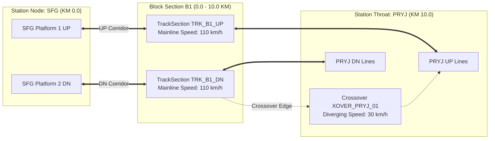

# Canonical Railway Corridor Topology

**Service Module:** `src/data_pipeline/topology.py` (`CanonicalRailwayTopology`)  
**Network Representation:** Directed MultiGraph ($G = (V, E)$)  
**Schema Specification:** `geometry_schema_version: "1.0.0"`  

---

## 1. Topological Architecture

The railway corridor is modeled as a **directed multigraph** preserving strict operational physics and Indian Railways General & Subsidiary Rules (G&SR):

1. **Directional Tracking:**
   - **UP Line:** Traffic moves in decreasing kilometer progression (towards terminal/division HQ).
   - **DOWN Line:** Traffic moves in increasing kilometer progression.
2. **Crossovers & Interlockings:**
   - Point machines and turnouts connect parallel lines at designated station throats (e.g. `SFG`, `NYN`, `BEP`, `MZP`).
   - Each crossover defines a directed edge with a speed-restricted divergence arc ($30\text{ km/h}$ or $50\text{ km/h}$).
3. **Station Loops & Platforms:**
   - Loop lines branch from mainline tracks before station home signals and rejoin after starter signals.
4. **Single-Source Lineage:**
   - The 3D and 2D renderers consume this single backend-validated canonical topology. No separate frontend-only topology is maintained.



---

## 2. Linear Referencing & Spatial Mappings

The topology service resolves multi-dimensional infrastructure entities to linear kilometer chainage:

- **Track Section by Chainage:** Resolves any kilometer value $K \in [0.0, 80.0]$ and direction to the exact enclosing `TrackSection`.
- **OHE Elementary Sections to Tracks:** Maps electrical catenary isolated zones (`ES-B4-01`) to all underlying UP, DOWN, or loop tracksBarring electric train traction during maintenance.
- **Signals to Interlocking Zones:** Maps track circuits, automatic block signals, and route-relay interlocking boundaries.
- **Train Telemetry Projection:** Maps RTIS GPS coordinates or scheduled corridor timetables to the exact canonical track polyline.

---

## 3. Canonical Topology Query Endpoints

The topology engine exposes typed query APIs at `POST /network/topology/query`:

### 3.1 Track Section by Chainage
```json
{
  "query_type": "track_by_chainage",
  "chainage_km": 34.5,
  "direction": "UP"
}
```
**Returns:** `TRK_B4_UP` with start/end KP and speed limit.

### 3.2 Route Between Two Points
```json
{
  "query_type": "route",
  "start_section_id": "TRK_B1_DN",
  "end_section_id": "TRK_B4_DN"
}
```
**Returns:** Ordered sequence of track sections, cumulative length in km, and intermediate interlockings.

### 3.3 Valid Temporary Single Line (TSL) Corridor
```json
{
  "query_type": "tsl_corridor",
  "blocked_track_id": "TRK_B4_DN"
}
```
**Returns:** Available parallel line (`TRK_B4_UP`), boundary crossover turnouts (`XOVER_KCN_01`, `XOVER_BEP_02`), and permissible bidirectional speed restrictions.

### 3.4 Possession & Train Conflict Query
```json
{
  "query_type": "possession_train_conflicts",
  "possession_id": "J14",
  "time_window": { "start": 16.0, "end": 19.0 }
}
```
**Returns:** Traversal conflicts, headway violations, and affected train identifiers.

### 3.5 Assets Inside Possession Boundary
```json
{
  "query_type": "assets_in_possession",
  "possession_id": "J18",
  "track_section_id": "TRK_B6_DN"
}
```
**Returns:** Ultrasonic flaw locations, switches, OHE masts, and track circuits enclosed within the possession limit.
